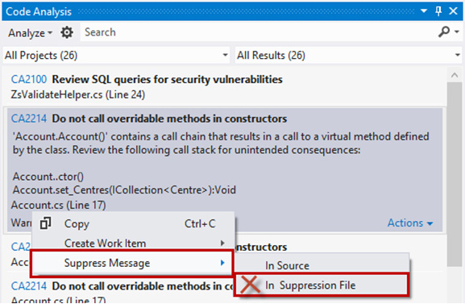
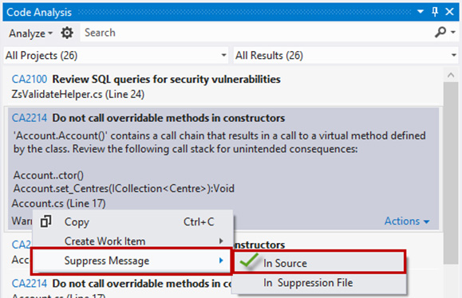

When running code analysis you may need to ignore some rules that aren't relevant to your application. Visual Studio has a handy way of doing thing. 
<!--endintro-->

::: bad

:::

::: good

:::

```cs
public partial class Account
{
    [System.Diagnostics.CodeAnalysis.SuppressMessage("Microsoft.Usage", "CA2214:DoNotCallOverridableMethodsInConstructors", Justification="Gold Plating")]
    public Account()
    {
        this.Centres = new HashSet();
        this.AccountUsers = new HashSet();
        this.Campaigns = new HashSet();
    }
}
```
::: good
Figure: Good example - The Solution and Projects are named consistently
:::
