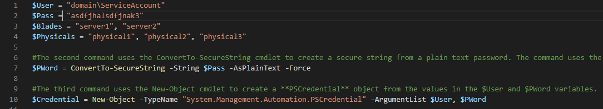

In PowerShell, you can easily create variables without explicitly typing them and that leads to some hardcoded "magic" strings.

Instead of using XML, JSON, YAML, or TXT files, PowerShell "accidentally" created a very nice configuration file format, PSD1.
PSD1 us the filename extension for PowerShell module descriptions, and this file contains metadata for that module. You can, however, load any kind of data from a PSD1 file using a simple cmdlet

<!--endintro-->

Import-PowerShellDataFile.

You can check a sample PSD1 file here:     [https://gist.github.com/ssg/a8e31af18ae8e03dcdc0f23e02793eca#file-sample-psd1](https://gist.github.com/ssg/a8e31af18ae8e03dcdc0f23e02793eca%22%20%5cl%20%22file-sample-psd1)

Some of the things we can do in a PSD1 file:

1. We can write comments;
2. We can use lots of data types, like int, float, bool, string, array...
3. We don't need to use quotes around field names like JSON;
4. And more.

Instead of keeping all your important URLs and FQDNs inside your PowerShell script, you should keep the script itself clean and "sanitized" from those hard-coded variables, so it can be freely shared on GitHub without any security concerns for you or your company. It also makes the script much more maintainable, where you can easily change the variables in the .PSD1 file without needing to change your core script.
Don't forget to add the configuration file to .gitignore!
<dl class="badImage">&lt;dt&gt;
      
   &lt;/dt&gt;<dd>Figure: Bad Example - Your script variables are in the script itself, making it insecure to share outside</dd></dl>
Credits to:     [PowerShell Accidentally Created A Nice Configuration Format](https://medium.com/%40ssg/powershell-accidentally-created-a-nice-configuration-format-3efde5448090).
