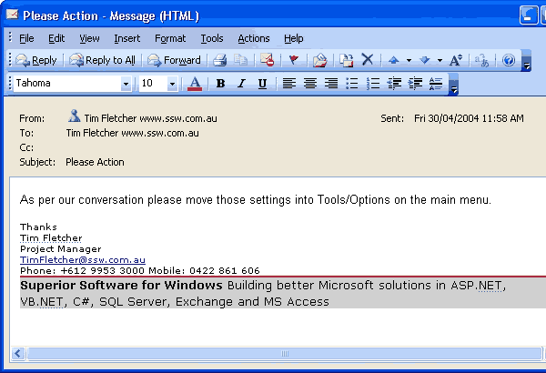

​​Email is a very powerful business tool. The main problem, however, is that for most people it is out of control - emails build up until they are impossible to manage. To help minimize mailbox clutter, try these tips: ​​ 
 <excerpt class='endintro'></excerpt> 
<ul><li>Send emails that contain clear tasks, not banter </li><li>If an email you receive is not clear, phone the sender and ask for clarification, then document it in a follow-up email “As per our conversation…”. Too many people reply by email asking for more information​​, which wastes time and does not guarantee a response.</li><li>If you speak to them, follow this rule: <a href="/Pages/SeekClarificationViaTelephoneFirst.aspx">Do you Seek Clarification Via the Telephone First</a> </li><li>If you can't get through, follow this rule: <a href="/_layouts/15/FIXUPREDIRECT.ASPX?WebId=3dfc0e07-e23a-4cbb-aac2-e778b71166a2&TermSetId=07da3ddf-0924-4cd2-a6d4-a4809ae20160&TermId=78b1a580-5e33-4b0e-ae87-f6039dde6dc6">Do you chase your Manager or does he have to chase you?</a> </li></ul>
Using your mailbox as a task list also saves you from having to use inefficient paper-based cards to track your tasks.
 
  Figure: Bad Example - A bad email is one that gives no clear action items and will probably lead to a back and forth thread (potentially with people misunderstanding each other)  Figure: Good Example - A good email has a clear next step action point 
<b>Tip 1:</b> ​It is better when email is not used as communication. Of course, if the person is unavailable, follow the ‘<a href="/Pages/DoYouAlwaysSendAnAsPerOurConversationEmail.aspx" shape="rect">as per our conversation</a>’ rule which tells you what to do.

E.g. "As per the message I left on your phone…" and detail the questions you would like answered. 

<b>Tip 2:</b> Make sure to number your tasks, if there is more than one, as per "<a href="/Pages/NumberSmallTasks.aspx" shape="rect">Do you number small tasks related to 1 topic</a>?"

   <b>VIDEO</b> - <a href="https://www.youtube.com/watch?v=LAqRokqq4jI">Top 10+ Rules to Better Email Communication with Ulysses Maclaren</a>  

