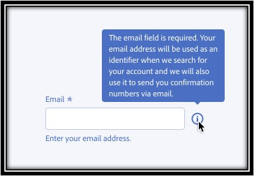
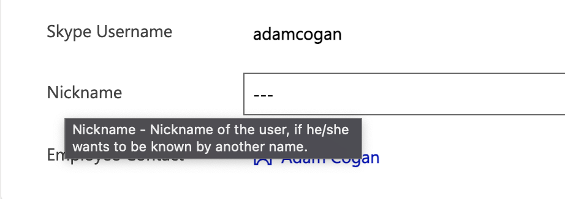
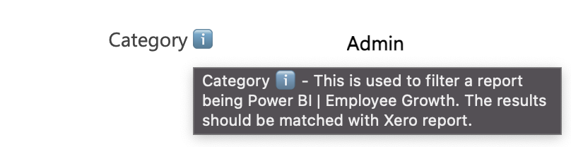

How do you show a tooltip or a note to a Dynamics user?

### Option 1 -  Description attribute

Advantages:

* Out of box feature.  No customizations needed.

Disadvantages:

* Not obvious to see - user normally doesn't aware to hover to the label to see the note.

### Option 2 -  PCF control

Advantages:

* Flexibility - allow to customize any style or behaviour.

Disadvantages:

* Need more time to develop or install a package.
* Introduce a dependent package to the system.

### Option 3 -  Description field + Emoji (Recommended)

Add a emoji in the label to remind people to hover to see the tooltip. 

