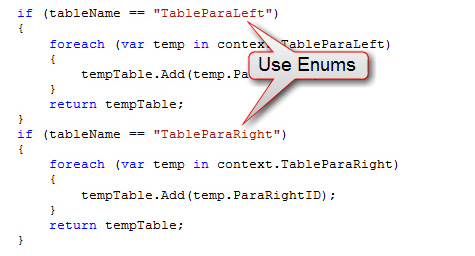

Use Enums instead of hard-coded strings, it makes your code lot  **cleaner** and is  **really easy to manage** .

<!--endintro-->
<dl class="badImage">&lt;dt&gt; &lt;/dt&gt;<dd>Figure: Bad example - "Hard- coded string" works, but is a bad idea</dd></dl><dl class="goodImage">&lt;dt&gt;&lt;/dt&gt;<dd>Figure: Good example - Used Enums, looks good and is easy to manage </dd></dl>
