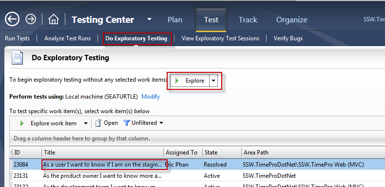
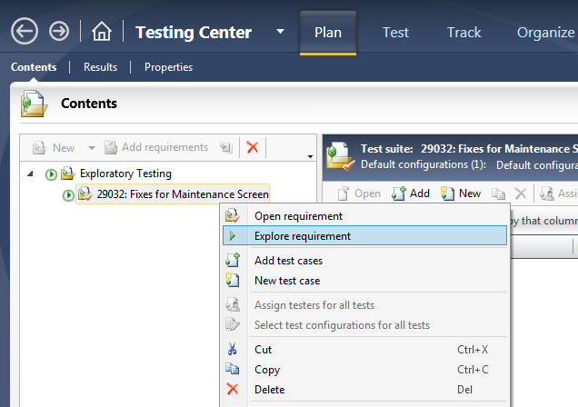
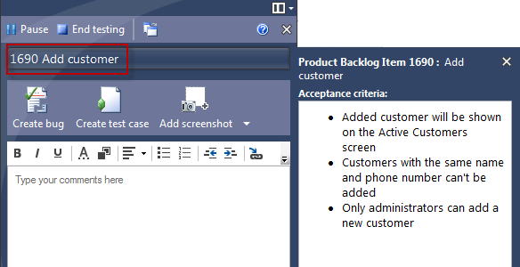
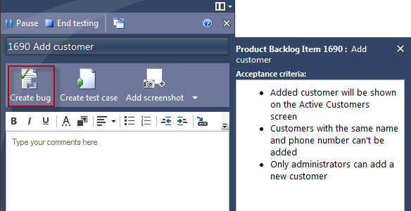
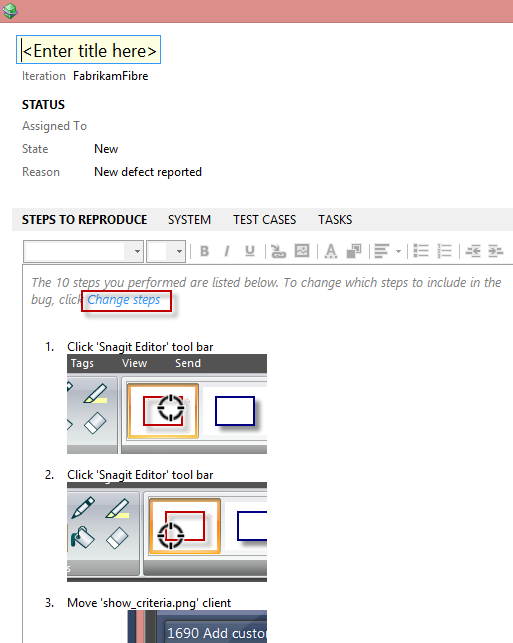
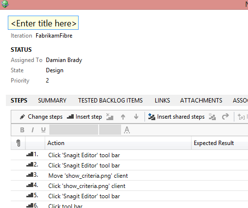

In an agile team, pre-planning all your tests is not always the most efficient use of time for testers.  PBIs can change direction, scope, and priority, and pre-planned tests are likely to change.
 

Exploratory testing provides the best way to create repeatable tests from the acceptance criteria - as you need them.​

 <excerpt class='endintro'></excerpt> 

There are two ways to run an exploratory test in Microsoft Test Manager.
<dl class="badImage"><dt></dt><dd>Figure: Bad Example - go to the Test tab, choose Do Exploratory Testing, choose a PBI, then click Explore. Too many steps​ </dd></dl><dl class="goodImage"><dt> </dt><dd>Figure: Good Example - Right-click on a requirement in your test suite and choose "Explore requirement" </dd></dl>

   <strong>Note: </strong>You should always run an exploratory test against a PBI. This will automatically relate any bugs and test cases to that PBI (not to mention the exploratory test run).

When you start an Exploratory test, you don't see any test steps, but you can click on the title of the requirement to see its Acceptance Criteria.
<dl class="image"><dt></dt><dd>Figure: Clicking on the title will show you the Acceptance Criteria</dd></dl>

   <strong>Note:</strong> <a href="/Pages/Do-Your-User-Stories-Include-Acceptance-Criteria.aspx">You should always have Acceptance Criteria on your PBIs!</a>

If you find a bug while testing, click the <strong>Create bug</strong> button to add a bug related to the PBI.
<dl class="image"><dt></dt><dd>Figure: Creating a bug from exploratory test links to the PBI</dd></dl>
By default, the reproduction steps will be populated with the last 10 actions you took (you can <a href="http://geekswithblogs.net/TarunArora/archive/2011/12/14/mtm-11-configuration-settings-amp-customization.aspx">change this and other defaults with configuration</a>).  You can cut this down to just the relevant actions by clicking Change steps.
<dl class="image"><dt></dt><dd>Figure: You can change the repro steps captured in the bug very easily</dd></dl>
Now you have a bug, you should create a matching test case so you can verify when the bug is fixed.  This also gives you a handy regression test to help ensure the problem isn't reproduced later.
<dl class="image"><dt></dt><dd>Figure: Click Save and create test to create a matching test case</dd></dl>
Again, the steps are prepopulated from your bug steps.
<dl class="image"><dt></dt><dd>Figure: The test steps are prepopulated from the action recording</dd></dl><h3 class="ssw15-rteElement-H3">Related Links</h3>
<ul><li>​<a href=/do-you-do-exploratory-testing-2>Do you do exploratory testing?</a>​ </li></ul>

