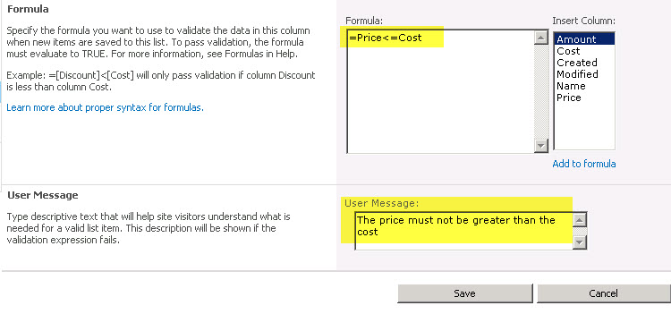

class CreateShoppingListHandler : SPItemEventReceiver
     {
         public override void ItemAdding(SPItemEventProperties properties)
         {
             float price = 0;
             float cost = 0;

             if(float.TryParse(properties.ListItem.Fields["Price"].ToString(), out price) && float.TryParse(properties.ListItem.Fields["Cost"].ToString(), out cost))
             {
                 if(price &lt; cost)
                 {
                     properties.ErrorMessage = "The cost must not be less than the price";
                     properties.Cancel = true;
                 }
             }            
         }
     }Bad example: using custom code – creating a custom event receiver on the item (the item adding event or item updating event)

Good example: using no code – just using the field validation on a list
 A demo of this from Andrew Connell on
http://channel9.msdn.com/learn/courses/SharePoint2010Developer/ListsAndSchemas/FieldandListItemValidation/
<!--endintro-->
