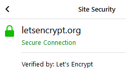
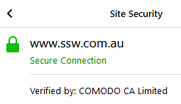

What is the best option for your business when it comes to securing your website with HTTPS?

<!--endintro-->

When you create a website, you can only access it through HTTP (http://website), and not securely through HTTPS if you do not own an SSL Certificate.

When it comes to website certificates, you can choose from free or paid SSL certificates!

Free certificates can be obtained from Certificate Authorities like Let's Encrypt, which is helping provide free and automated certificates for the web.

1. Free certificates provide the same level of SSL encryption as paid certificates;
2. Free certificates provide HTTPS with a green padlock on the address bar of your browser, just like paid certificates;
3. Free certificates can be automatically renewed, easily.

 

::: good
Good Example: Let's Encrypt Free Certificate Authority

:::

Why would anyone use paid certificates, then?

If you are operating a big business, paid certificates give you some more assurances over free ones, and you can obtain them through reputable Certificate Authorities like Comodo, GeoTrust, Symantec, etc:

1. Paid certificates gives you warranty against misuse or wrongly issued certificates;
2. Paid certificates are normally valid for at least 1 year or more, while free certificates are only valid for 3 months;
3. Paid certificates offer support for any errors or problems you have with your certificates.

::: good
Good Example: Comodo Paid Certificate Authority

:::

SSL Certificates are an important part of any reputable website, so if you are operating a small website, blog, testing environment, personal site, anything that doesn't need too much support, getting a free certificate is the way to go.

If your business or site does not fit on the above affirmation, getting a paid certificate is the best option!
