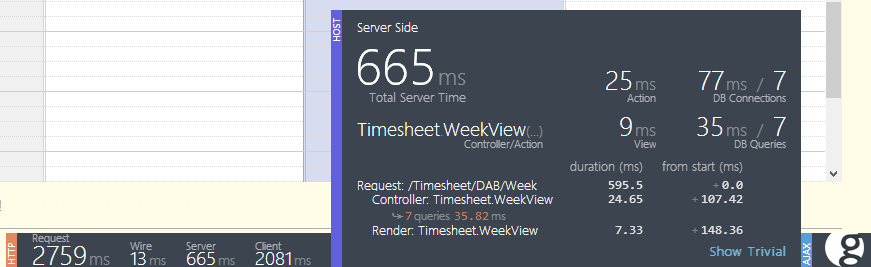
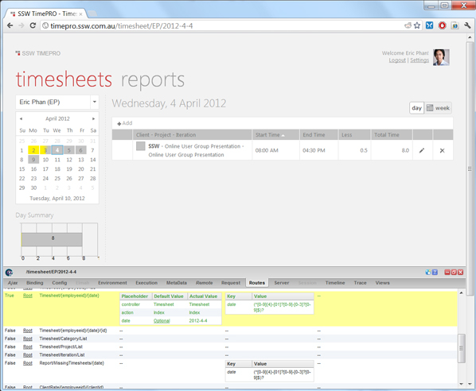

Glimpse allow you to easily perform diagnostics on your MVC application at runtime.
As an ASP.NET developer (including ASP.NET MVC), you should use it all the time.

<!--endintro-->

Glimpse lets you find useful information like:

* Routing information
* Profiling
* Request information
* Parameters passed into actions
* Model inspector

The new version of Glimpse now also gives you a Heads Up Display (HUD) showing you important information all the time.  While developing, it's a good idea to keep Glimpse open so you can see any issues as soon they come up.

Figure: The new Glimpse Heads Up Display

For more information on what the HUD provides, see [Damian Brady's blog post](http://blog.damianbrady.com.au/2013/06/12/glimpse-heads-up-display-released/).

Glimpse is available on NuGet, so it’s a simple matter to get it up and running on your application. You can find out more from [their website](http://getglimpse.com/).
**Figure: Glimpse in action - We can see which routes were chosen for this page, and the parameters used by the controller**  
## Securing Glimpse for production use

Glimpse is very powerful but there are some considerations to be addressed before using it on Production.

* 1. Security: Enabling Glimpse can reveal many details about your server – including full database connection details. Glimpse also publishes a full list of all the actions your MVC site can perform so you should thoroughly test the security on all restricted actions before you consider enabling Glimpse.
* 2. Performance: Running Glimpse involves sending debug data with every request. This can impact site performance.

Even with these considerations, Glimpse can provide some unique insights into production server performance so it’s worth spending the time to correctly configure Glimpse for production use.

#### Glimpse on Production Level 1: Developers Only

Install Glimpse on production so that only internal developers can enable it.This is achieved by:

* Limiting access to an ip address range. 

&lt;glimpse enabled="true"&gt;

    &lt;ipAddresses&gt;

      &lt;add address="127.0.0.1" /&gt;

      &lt;add addressRange="192.168.1.1/24" /&gt;

      &lt;add address="::1" /&gt;

    &lt;/ipAddresses&gt;
  &lt;/glimpse&gt;
 **Figure: Glimpse is now limited to localhost and the 192.168.1.x network**
* Using role-based authentication.
If your site has role-based authentication, you can secure Glimpse usage by editing web.config to control access to the Glimpse.axd location.

&lt;location path="glimpse.axd"&gt;

&lt;system.web&gt;

         &lt;authorization&gt;

              &lt;allow roles="Developers" /&gt;

              &lt;deny users="\*" /&gt;

         &lt;/authorization&gt;

&lt;/system.web&gt;

&lt;/location&gt; 
 **Figure: Glimpse is restricted to the Developers group**

#### Glimpse on Production Level 2: Public by invitation only

If an end-user reports a problem on your website it can be useful to temporarily enable Glimpse for that user. Glimpse also has remote features allowing developers to see the user’s Glimpse data.

* Create a new authentication role such as "PublicGlimpseUsers"
* Edit web.config to control access to Glimpse.axd

&lt;location path="glimpse.axd"&gt;

&lt;system.web&gt;

         &lt;authorization&gt;

              &lt;allow roles="Developers, PublicGlimpseUsers" /&gt;

              &lt;deny users="\*" /&gt;

         &lt;/authorization&gt;

&lt;/system.web&gt;

&lt;/location&gt; 
 **Figure: Glimpse.axd is now restricted to Developers  and PublicGlimpseUsers 
**
* Disable the “config” section of Glimpse so that site connection strings are not published. 

&lt;pluginBlacklist&gt;

      &lt;add plugin="Glimpse.Core.Plugin.Config" /&gt;

&lt;/pluginBlacklist&gt;
**Figure: How to disable the Config tab **
