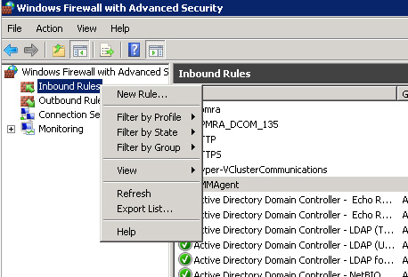
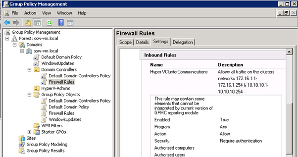

Don't log in and make manual changes to the clustered nodes.

When working with clustered environments it is important that settings be consistent across every node. The best way to handle this is through group policy.

<!--endintro-->

Create a policy that you would like applied to each node of the cluster using the **Group Policy Management** .

