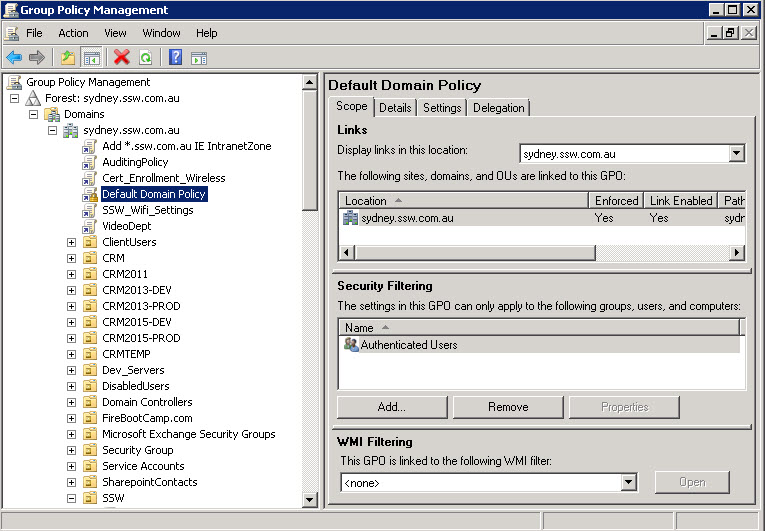

​​Group Policy is simply the easiest way to reach out and configure computer and user settings on network based on Active Directory Domain Services (AD DS). If your business is not using Group Policy, you are missing a huge opportunity to reduce costs, control configuration, keep users productive and happy, and harden security. Think of Group Policy as "touch once, configure many."
 

 <excerpt class='endintro'></excerpt> 

​You can manage all aspects of Group Policy by using the Group Policy Management Console (GPMC). You start the GPMC from the Start menu: Click Start, All Programs, Administrative Tools, Group Policy Management. You can also click Start, type Group Policy Management, and then click Group Policy Management in the Programs section of the Start menu. Windows Server 2008 onwards include the GPMC when they are running the AD DS role. 

 

Figure: Group Policy Management Console showing GPO 

