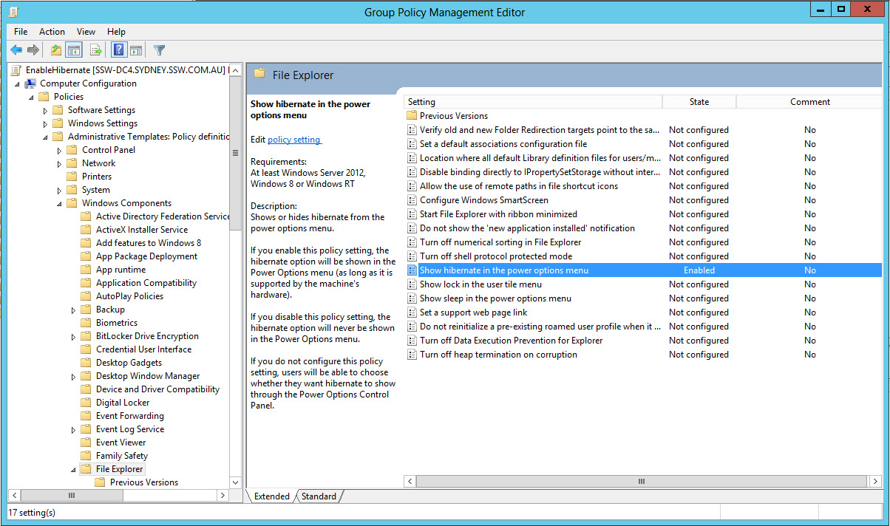
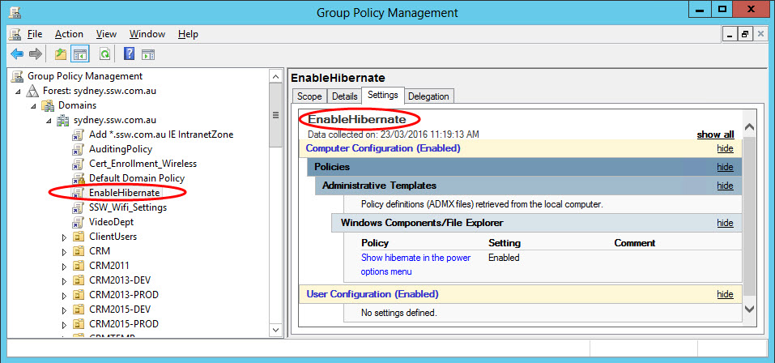
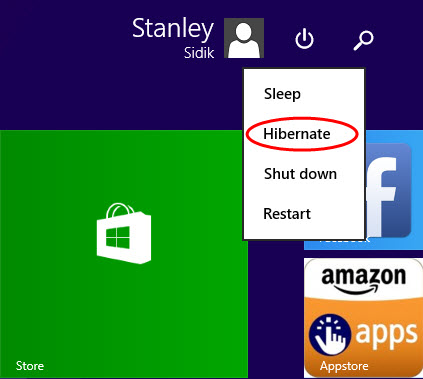

Group Policy is a fast and effective way to configure Hibernate on multiple PC's
 <excerpt class='endintro'></excerpt> 

​To enable Hibernate option in Group Policy open up Group Policy Management. 

1. Create a new Group Policy Object and name it "EnableHibernate"

2. Right click on "EnableHibernate" and click on Edit to bring up Group Policy Management Editor

3. Select '<em>Show hibernate in the power options menu</em>' from <strong>Computer Configuration | Policies | Administrator Templates | Windows Component | File Explorer </strong>and set to Enabled  

4. Back in Group Policy Management Enable Link for "EnableHibernate"    

5. Wait for a few moment for GPO to refresh and apply. Alternatively manually force a GP Update through Command Prompt - GPUpdate /force. Check that Hibernate Option is now in Start Menu.  

 

