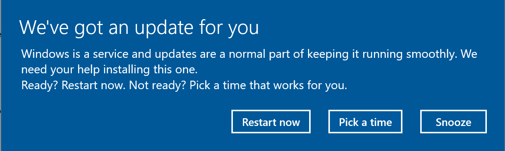
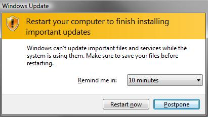
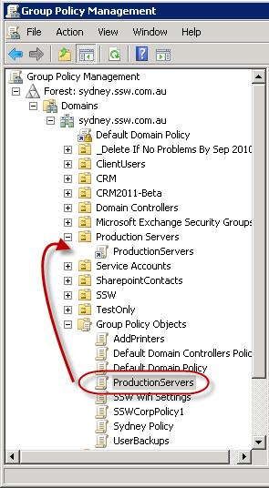
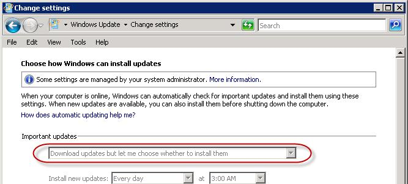

We all know it’s important to keep our servers updated. Unfortunately though, by default, Windows will automatically download and install all new Windows Updates on your servers. This will mean the servers will occasionally restart to install updates when you don’t want them too. You will also get annoying popups trying to get you to restart the computer.  
 <excerpt class='endintro'></excerpt> 

   <b>Note:</b> This rule applied to both client PCs and servers.

    

It is also one more reason developers don’t like to join a company domain on their personal laptops!  
<dl class="badImage"><dt> 
       
   </dt><dd>Bad Example - Windows 10 shows a ‘Restart now’ – do not accidentally press it! Your production server and your users won't be happy!</dd></dl><dl class="badImage"><dt>​ </dt><dd>Bad example – Remember this nasty one from Vista days?</dd></dl>

   <b>Note: </b>Server patching is also achievable via SCCM and you get more control over restarting windows like this. WSUS can also be used in conjunction with group policies to handle restart times better.

The best ensure you are still downloading updates but not installing them automatically is to use Group Policy.
<ol><li>Create an Organization Unit (OU) in Active Directory, and put all your Production Servers in the OU  
      <dl class="image"><dt> 
             
         </dt><dd>Add all your Production Servers to the Production Server OU</dd></dl></li><li>Create a new Group Policy object and link it to the Production Server OU  
      <dl class="image"><dt> 
             
         </dt><dd>Create a new Group Policy for your Production Servers</dd></dl></li><li>Edit the new Group Policy object and drill down to 
      <strong>Computer Configuration</strong> | 
      <strong>Policies </strong>| 
      <strong>Windows Components</strong> | 
      <strong>Windows Update</strong> </li><li>Edit the 
      <strong>Configure Automatic Update Properties</strong> item and 
      <strong>enable </strong>it</li><li>Set the 
      <strong>Configure Automatic Updating</strong> option to 
      <strong>3 – Auto download and notify for install  
         <dl class="image"><dt> 
                
            </dt><dd>Edit Configure Automatic Updates Properties and enable 'Auto download and notify for install</dd></dl> </strong></li></ol>
After the new Group Policy propagates, you will notice the update setting is now locked on the servers in the Production Server OU.
<dl class="goodImage"><dt> 
       
   </dt><dd>The Group Policy locks the Windows Update setting</dd></dl>

From now on your servers will be updated without unplanned reboots! 
<dl class="image"><dt> 
      
   </dt><dd class="ssw15-rteElement-FigureGood">     Figure: Good example - AD shows the Group Policy setting “3 – Auto download and notify for install”. This policy is applied to the specified OU eg. Production Servers joined to this domain 
       </dd></dl>

<h3> ​​Related Rules </h3><ul><li>
      <a href="/_layouts/15/FIXUPREDIRECT.ASPX?WebId=3dfc0e07-e23a-4cbb-aac2-e778b71166a2&TermSetId=07da3ddf-0924-4cd2-a6d4-a4809ae20160&TermId=f5432cb4-40af-491b-8da5-33b8a80dcb0a">​Do you enable automatic Windows Update Installations?​</a> [for PCs] </li><li>
      <a href="/_layouts/15/FIXUPREDIRECT.ASPX?WebId=3dfc0e07-e23a-4cbb-aac2-e778b71166a2&TermSetId=07da3ddf-0924-4cd2-a6d4-a4809ae20160&TermId=3b0722be-c3e3-4369-a590-258c7501a67a">Do you turn off auto-update on your servers?</a> [for Servers]​ </li></ul>

