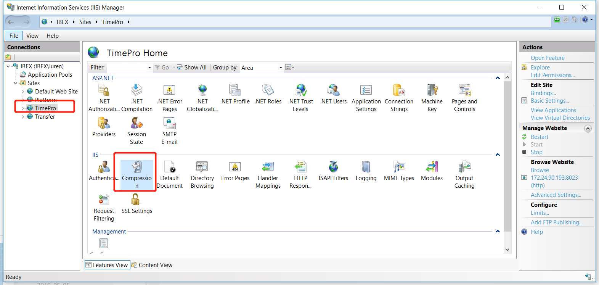
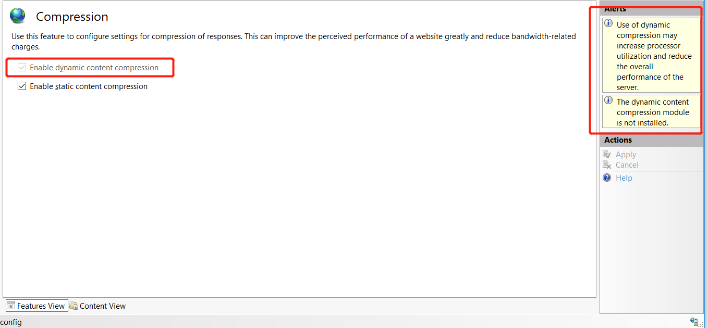
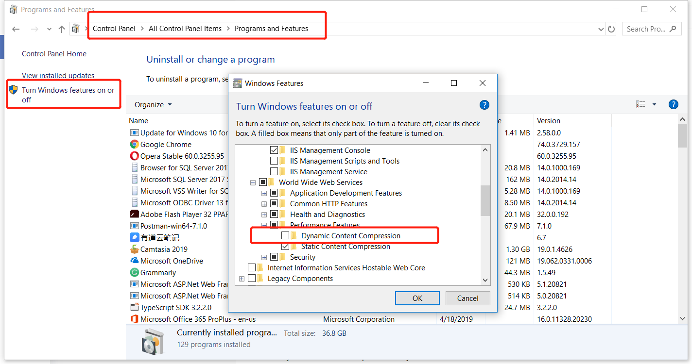
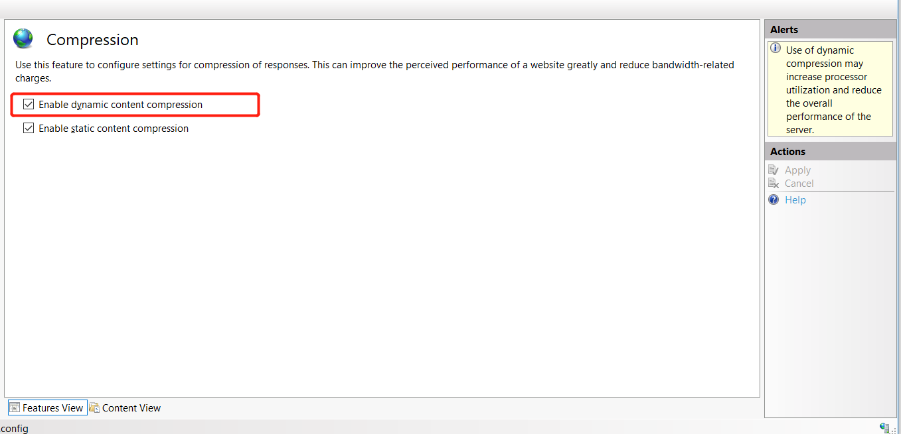
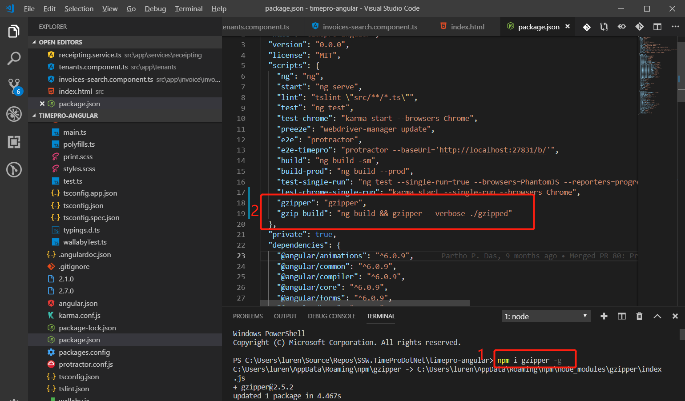
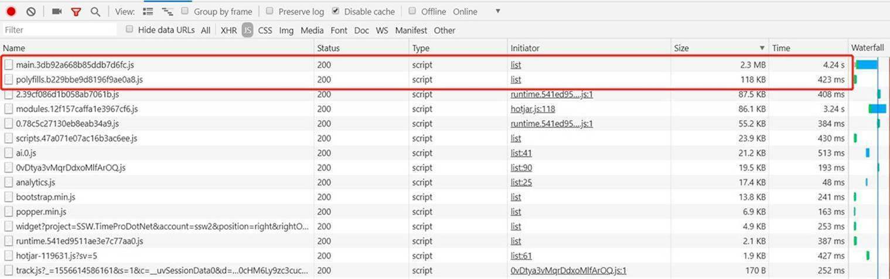

​Gzip is a file format and a software application used for file compression and decompression. Gzip can reduce file size and storage space, and reduce transmission time when transferring files over the network. It runs on both Linux and Windows.
 

 <excerpt class='endintro'></excerpt> 

​Use PageSpeed Insights extension in Chrome to determine if your site will benefit from using Gzip. 

For more information about how to use PageSpeed to find which files on your site would benefit from being compressed with Gzip see <a href=/do-you-use-pagespeed target="_blank">Do-you-use-PageSpeed</a>.​ 

<strong>​ ​</strong><strong>Three ways to add Gzip compression to your site: ​</strong>

Use one of the methods described below to add Gzip compression to your site ASP.Net/Angular website

​ 
<ul><li>Method 1: Turn on "Dynamic Content Compression" In IIS Server. Figure: Choose the website which you want to use Gzip and click on Compression.​​​​Figure: Install "dynamic content compression" if you haven't installed it.​ </li> 
     ​​  In 
   <strong>Control Panel</strong> navigate to 
   <strong> All Control Panel Items | Programs and Features </strong>, and click 
   <strong>Turn Windows features on or off</strong>. Choose 
   <strong>Internet Information Services | Web Management Tools | World Wide Web Services | Performance Features | Dynamic Content  ​</strong><strong>Compression</strong>.Figure : Click "Ok" to install it.​​Figure: now enable dynamic content compression for your site. 
   
 
        
      <ul><li>​​<strong>​</strong>​Method 2:  Using “Gzipper” in your Angular website​ </li> Follow  
          
            <a href="https://www.npmjs.com/package/gzipper">https://www.npmjs.com/package/gzipper</a> .(but it still need IIS Server enable static content compression.) 
         ​ Using "npm i gzipper g" to install "gzipper" first. Add to scripts in your package.json​​​​   Figure: "Finish configuration like that. 
           
         <li>Method 3: ​​​​​​​​​​Using ASP.NET code in MVC​ </li> Refer to 
          
            <a href="https://www.codeproject.com/Tips/1080065/Improve-the-Performance-of-ASP-NET-MVC-Web-Applica">https://www.codeproject.com/Tips/1080065/Improve-the-Performance-of-ASP-NET-MVC-Web-Applica</a> . ​ 
             To implement this in ASP.NET MVC, we can utilize ActionFilterAttribute and override either OnActionExecuting or OnResultExecuting method. The below code snippet is being used to check whether the current request browser can accept GZIP/DEFLATE encoding by looking at Accept-Encoding request header. If it finds GZIP encoding in this header, then we would set gzip in Content-encoding in response header and if it supports DEFLATE, then this code would set deflate in Content-encoding.
            <pre>               

​<code class="language-sh">
using System;
using System.Collections.Generic;
using System.IO.Compression;
using System.Linq;
using System.Web;
using System.Web.Mvc;

namespace HTTPCompression.ActionFilters
{
    public class CompressAttribute : ActionFilterAttribute
    {
        public override void OnResultExecuting(ResultExecutingContext filterContext)
        {
            HttpRequestBase request = filterContext.HttpContext.Request;

            string acceptEncoding = request.Headers["Accept-Encoding"];

            if (string.IsNullOrEmpty(acceptEncoding)) return;

            acceptEncoding = acceptEncoding.ToUpperInvariant();

            HttpResponseBase response = filterContext.HttpContext.Response;

            if (acceptEncoding.Contains("GZIP"))
            {
                response.AppendHeader("Content-encoding", "gzip");
                response.Filter = new GZipStream(response.Filter, CompressionMode.Compress);
            }
            else if (acceptEncoding.Contains("DEFLATE"))
            {
                response.AppendHeader("Content-encoding", "deflate");
                response.Filter = new DeflateStream(response.Filter, CompressionMode.Compress);
            }
        }
    }
}​​
</code>
</pre> 
            <pre>                                          
<code class="language-sh">
[Compress] 
 public ActionResult About() ​
 { 
    ViewBag.Message = "Your application description"; 
    return View(); 
 } 
</code>​​
</pre> <pre> </pre><dd class="ssw15-rteElement-FigureBad">​Figure: Bad Example​, files with large size and slow load time. ​ </dd>
​​​ 
<dd class="ssw15-rteElement-FigureGood">​​​​Figure: Good Example​, gzipped files with smaller size and faster load time.  </dd> </ul>​    
</ul>

