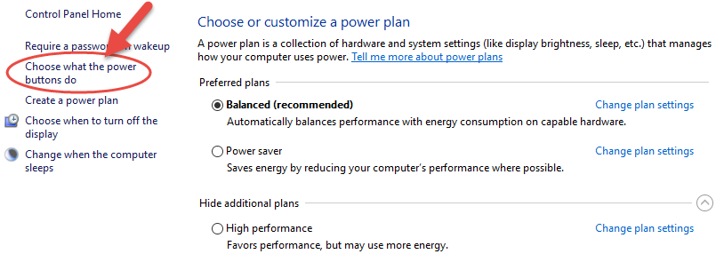
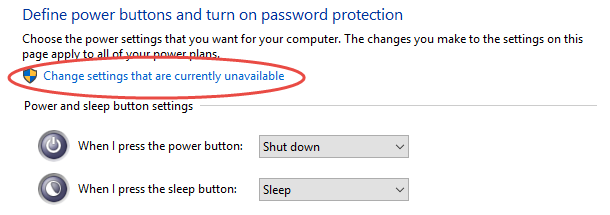
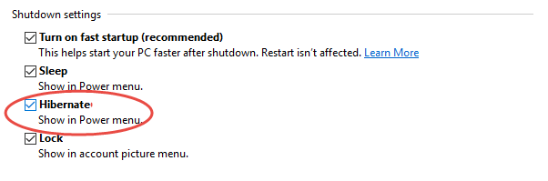
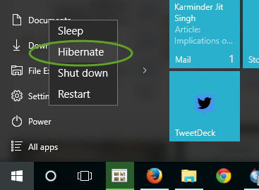

Hibernate is a power-saving state designed primarily for laptops, and might not be available for all PCs. Hibernation is a state in which the Windows PC saves the current state and shuts itself down so that it no longer needs power. When the PC is turned on again, all open files and programs are restored to the same state as they were before hibernation. Windows 10 by default does not include the Hibernate option under the power menu, but there’s an easy way to enable it. Here’s how to make Windows show Hibernate alongside Shut Down in Power menu.
To enable the Hibernate option in Windows 10, make sure that your system hardware supports hibernation and then follow the steps below to enable it. (Do not use Hibernate of Fast Startup if you are dual booting).

1. Open Power Options by typing *Power Options* in Start and choosing the first result.
 Alternatively, you can right-click on the Start button and select *Power Options*.
2. Select *Choose what the power buttons* do from the left panel.
3. Click on *Change settings that are currently unavailable*.
4. Now check the box in front of *Hibernate – Show in Power menu* under Shutdown settings.
5. Finally click on Save settings and you will now find the Hibernate option under the Power menu on Start or Win + X menu.

Love hibernate? Make sure that you still properly shut down your PC once in a while to keep it working normally.

If you are a Domain Administrator and need to have this done to multiple devices within AD DS then check you Do you use Group Policy to enable Hibernate Option.

<!--endintro-->
