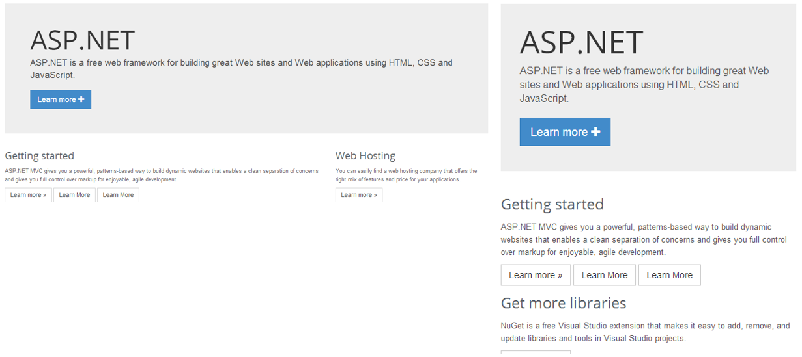
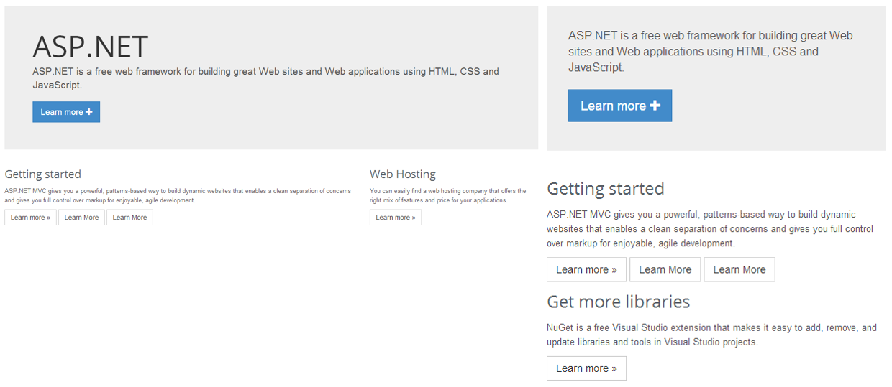

When designing responsive websites, it's important to consider what content is appropriate for each screen size. Desktops might have large navigation areas and extra content in a sidebar, whereas the phone might focus on other content.

<!--endintro-->

By default, Bootstrap will wrap the columns and make them full width on phones. If you want to hide content rather than let it wrap you can use the `.d-none` class or one of the `.d-{sm,md,lg,xl}-none` classes for any responsive screen variation.

More information on [Display property - Quickly and responsively toggle the display value of components and more with our display utilities](https://getbootstrap.com/docs/4.0/utilities/display/#how-it-works).

::: bad  
  
:::

Remove the title by adding the .hidden-xs class.

``` html
<h1 class="d-xl-none">ASP.NET</h1>
```

::: good  
  
:::
