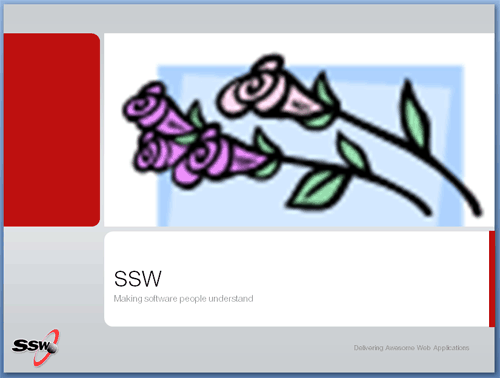
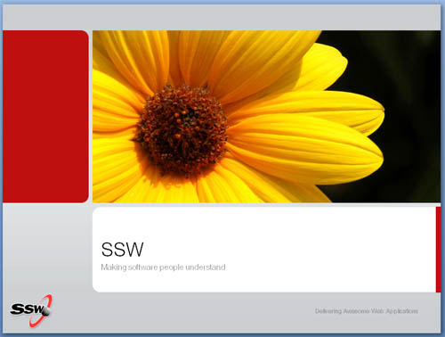

 
  
Never stretch small, low-resolution photos to make it fill up the space. This degrades the resolution and the image will appear very coarse and granular on the projection screen.

The quality of your images is a subconscious message to your audience. If you use low quality pictures, then you unintentionally suggest the same message about your product.

For this reason, we encourage you to choose only high quality photos and to avoid cartoons and word art.

 

  <dl>
    <dt> </dt>
    <dd class="ms-rteCustom-FigureBad">Figure&#58; Bad Example - What is this monstrosity! </dd>
</dl>
<dl>
    <dt> </dt>
    <dd class="ms-rteCustom-FigureGood">Figure&#58; Good Example - Looks classy, that. </dd>
</dl>

