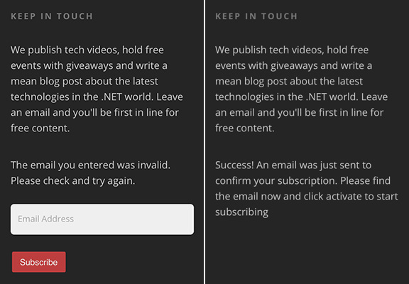
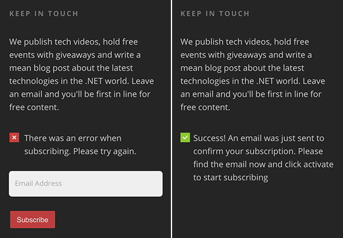

People may not pay attention to some important words in your pages. While adding a simple and clear icon beside the words will make the difference. 

- [Add a green tick for successful messages or a red cross for error messages](/messages-do-you-use-green-tick-red-cross-and-spinning-icon-to-show-the-status) 
- [Add the type of file next to download links](/use-icons-to-not-surprise-users)
- [Add an icon to external links](/do-you-make-external-links-clear)
- Add a lock icon to indicate the links where a password is required

<!--endintro-->

::: bad  
  
:::

::: good  
  
:::
