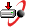
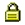
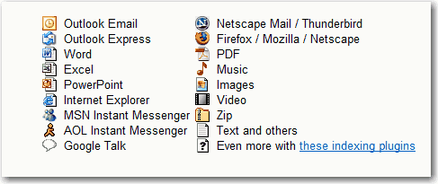

When a user clicks on a hyperlink they expect to open an HTML​ file. If you click on a hyperlink (but it is actually a .doc file) you wait and wait while it takes forever to instantiate an instance of Microsoft Word in the background.  

 <excerpt class='endintro'></excerpt> 

Don't surprise users! Use the following icons:
 
<table cellspacing="0" cellpadding="3" class="normal" style="width:100%;"><tbody><tr><th scope="col">File Type</th><th scope="col">Example</th></tr><tr><td>PDF</td><td> 
             This is a PDF file </td></tr><tr><td>JPG</td><td> 
             This is an Image file</td></tr><tr><td>DOC or DOT</td><td> 
             This is a Word Document file</td></tr><tr><td>XLS</td><td> 
             This is an Excel Spreadsheet file</td></tr><tr><td>PPT</td><td> 
             This is a PowerPoint file</td></tr><tr><td>TXT</td><td> 
             This is a Text file</td></tr><tr><td>AVI, MOV, MPG etc.</td><td> 
             This is a Video file</td></tr><tr><td>WAV, WMA, MP3 etc.</td><td> 
             This is a Music file</td></tr><tr><td>SNP</td><td> 
             This is an Access Database snapshot file (discontinued and not recommended)</td></tr><tr><td>EPS</td><td> 
             This is an EPS file</td></tr><tr><td>ICS or VCS</td><td> 
             This is a calendar file</td></tr><tr><td>EXE or ZIP</td><td> 
            This is an executable or zip file</td></tr><tr><td>Mailto:</td><td> 
             This will send an email</td></tr><tr><td>XML / RSS</td><td> 
             This will subscribe to RSS</td></tr><tr><td>ODF</td><td> 
             This is an Outlook Item Template</td></tr><tr><td>Page</td><td> 
             This is a link to password protected page</td></tr><tr><td rowspan="1">YouTube</td><td rowspan="1">​This is a link to a YouTube Video</td></tr></tbody></table><dl class="image"><dt>  </dt><dd>Figure: FYI there are the same images used by Google at <a href="http://desktop.google.com/features.html">GoogleDesktopSideBar.htm</a>    </dd></dl><dl class="badImage"><dt>  </dt><dd>Figure: Bad Example - The user would expect all these hyperlinks to work the same way  </dd></dl><dl class="goodImage"><dt>  </dt><dd>Figure: Good Example - The pdf icon (before a hyperlink) indicates it is not a web page </dd></dl><h3>How to add an icon before a link with CSS</h3>
Add the icon image to your server. Then use $= to make the match the extension of the &gt;a&lt; tag on your CSS. The padding is to give it some space before the text (where the icon will be).

a[href$='.pdf']  {  background: transparent url(/images/icon_pdf.gif) center left no-repeat;  padding-left: 20 px;  }

 
     
   
We have the programs <a href="http://www.codeauditor.com/" target="_blank">SSW CodeAuditor</a> and <a href="https://linkauditor.com.au/" target="_blank">SSW LinkAuditor</a> to check for this rule. 

