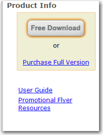
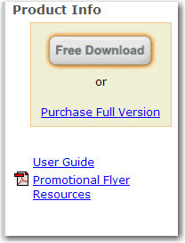

When a user clicks on a hyperlink they expect to open an HTML file. If you click on a hyperlink (but it is actually a .doc file) you wait and wait while it takes forever to instantiate an instance of Microsoft Word in the background.

<!--endintro-->

::: todo
1. Implement the icons to SSW Rules 
2. Add examples to [Example Rule + Markdown Cheatsheet](https://www.ssw.com.au/rules/rule)
3. Improve the examples in this rule
:::

Don't surprise users! For the following file/link types, use icons:

- PDF: [This is a PDF file](Sample-PDF.pdf)
- DOC or DOT: [This is a Word Document file](Sample-DOC.docx)
- XLS: [This is an Excel Spreadsheet file](Sample-XLS.xlsx)
- PPT: [This is a PowerPoint file](Sample-PPT.pptx)
- TXT: [This is a text file](Sample-TXT.txt)
- AVI, MOV, MPG etc.: [This is a video file](sample-VIDEO.mp4)
- WAV, WMA, MP3 etc.: [This is a music file](sample-MP3.mp3)
- ICS or VCS: [This is a calendar file](Sample-ICS.ics)
- ZIP: [This is a zip file](Sample-ZIP.zip)
- YouTube: [This is a link to a YouTube Video](https://www.youtube.com/watch?v=gp_F43lx6iM)
- Mailto: [This link will send an email](mailto:someone@example.com)

You should also use an icon to [make external links clear](/do-you-make-external-links-clear).

::: bad  
  
:::

::: good  
  
:::

### How to add an icon before a link with CSS

Match the extension of the &lt;a&gt; tag on your CSS. The padding is to give it some space before the text (where the icon will be).

#### (Recommended) Using font icons, like FontAwesome

Find the icon unicode at [FontAwesome icons page](https://fontawesome.com/icons) and replace on the CSS "content" value.

```css
a[href$='.pdf']:before
    content: "\F08B ";
    font-family: FontAwesome;
    padding-right: 4px;
    display: inline-block;
}
```
**Figure: Adding an icon before - for different file or link types**

#### Using images

Add the icon image to your server and add the path as background URL.

```css
a[href$='.pdf'] 
{ 
background: transparent url(/images/icon_pdf.gif) center left no-repeat; 
padding-left: 20 px; 
}
```
