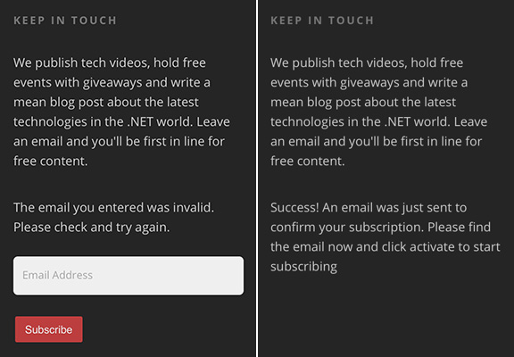

People may not pay attention to some important words in your pages. While adding a simple and clear icon beside the words will make the difference. Add a green tick for successful messages and a red cross for error messages.

<!--endintro-->
<dl class="image">&lt;dt&gt;&lt;/dt&gt;</dl><dl class="badImage">&lt;dt&gt; 
       
   &lt;/dt&gt;<dd>Figure: Bad example - no icons to indicate the status</dd></dl><dl class="goodImage">&lt;dt&gt; 
       
   &lt;/dt&gt;<dd>Figure: Good example - green tick and red cross help the user to know what's going on</dd></dl>
### Related Rules

* If you need to find some icons - [Do you know where you can find some nice icons?](/_layouts/15/FIXUPREDIRECT.ASPX?WebId=3dfc0e07-e23a-4cbb-aac2-e778b71166a2&TermSetId=07da3ddf-0924-4cd2-a6d4-a4809ae20160&TermId=fc60e355-3564-4d94-8b82-68503f12352b)
* There is a  similar rule for WinForm application - [Do you use green tick, red cross and spinning icon to show the status?](/_layouts/15/FIXUPREDIRECT.ASPX?WebId=3dfc0e07-e23a-4cbb-aac2-e778b71166a2&TermSetId=07da3ddf-0924-4cd2-a6d4-a4809ae20160&TermId=06bcd7b6-391c-4cfb-a715-b09c05bde154)
