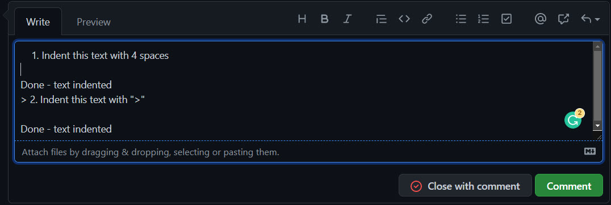
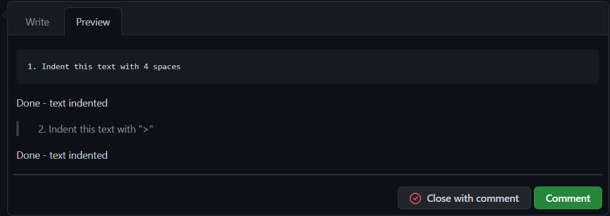

Written communication can easily cause misunderstandings. Help the reader understand your message better by:

* Using “&gt;” and indentation when quoting the text from others, like the original email you are replying to, or a web page, etc.
* Your new text should be kept to the left
* Optionally, [use a different text color in your reply](/when-you-reply-inline-do-you-use-a-different-color)
* Add numbers if the sender didn't and it is appropriate

<!--endintro-->

This way you won't forget any questions in the original email.

::: email-template
|          |     |
| -------- | --- |
| To:      | Adam |
| Subject: | RE: Change on Northwind app |
::: email-content  

### Hi Adam,

Please change from X to Y\
The program flow logic worries me a bit\
Done. Sorry, this wasn't a final decision - I just put it there for testing purposes 

:::
:::
::: bad
Figure: Bad Example - there's too much information here
:::

::: email-template
|          |     |
| -------- | --- |
| To:      | Adam |
| Subject: | RE: Change on Northwind app |
::: email-content  

### Hi Adam,

     &gt; 1. Please change from X to Y\
Done - \[add a link to the page or a screenshot];

     &gt; 2. The program flow logic worries me a bit\
Sorry, this wasn't a final decision - I just put it there for testing purposes  

:::
:::
::: good
Figure: Good Example - You can clearly see the context of each part of the reply
:::

::: greybox
**Note:** 

* When using Outlook, the raw “>” character may be automatically formatted to a “>” bullet point. This change is a problem because it may change to a normal bullet point after being sent. To prevent this issue, press Control+Z to turn it back into the raw “>” character.
* For those using mobile devices the indentation function is not available, try instead using 3 spaces to indent manually. 
  :::

## GitHub

When using GitHub, you can use 4 spaces to indent a task and get clear separation between task and response. You can also use a "&gt;" symbol to achieve a similar result.

You can find more info about GitHub syntax at [Basic writing and formatting syntax](https://docs.github.com/en/github/writing-on-github/getting-started-with-writing-and-formatting-on-github/basic-writing-and-formatting-syntax).

- - -

`youtube: https://www.youtube.com/embed/LAqRokqq4jI`

<!--StartFragment-->

**Video: Top 10+ Rules to Better Email Communication with Ulysses Maclaren**

<!--EndFragment-->