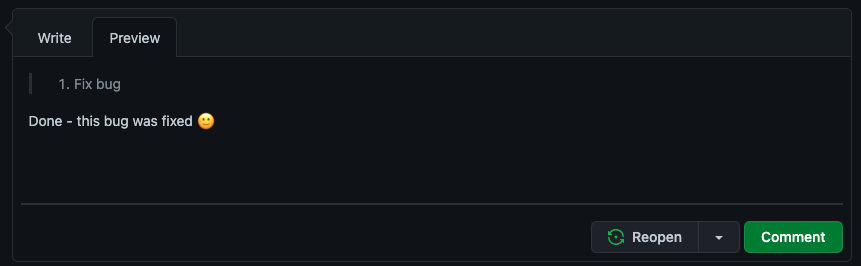
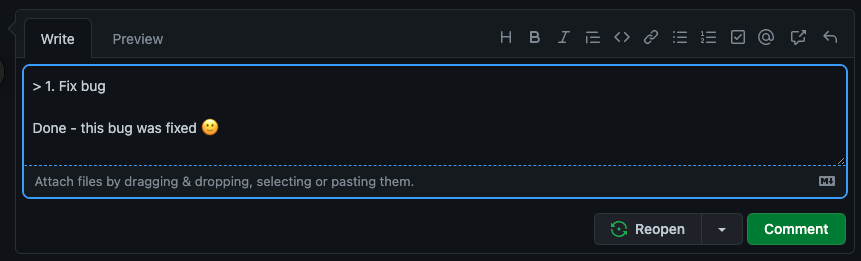

Written communication can easily cause misunderstandings. Help the reader understand your message better by:

* Using “&gt;” and indentation when quoting the text from others, like the original email you are replying to, or a web page, etc.
* Your new text should be kept to the left
* Add numbers if the sender didn't and it is appropriate

<!--endintro-->

This way you won't forget any questions in the original email.

**Note:** You do not need to use ">" and indentation, when you are replying to the task that is very clear, because in this case extra text reduces clarity.

::: email-template
|          |     |
| -------- | --- |
| To:      | Adam |
| Subject: | RE: Change on Northwind app |
::: email-content  

### Hi Adam,

Please change from X to Y\
The program flow logic worries me a bit\
Done. Sorry, this wasn't a final decision - I just put it there for testing purposes 

:::
:::
::: bad
Figure: Bad example - There's too much information with no reasonable order
:::

::: email-template
|          |     |
| -------- | --- |
| To:      | Adam |
| Subject: | RE: Change on Northwind app |
::: email-content  

### Hi Adam,

&nbsp;&nbsp;&nbsp; > 1. Please change from X to Y  
Done - {{ LINK }}  
&nbsp;&nbsp;&nbsp; > 2. The program flow logic worries me a bit  
Sorry, this wasn't a final decision - I just put it there for testing purposes  

:::
:::
::: bad
Figure: Bad example - Even with order, without spacing the text becomes cramped and hard to read.
:::

::: email-template
|          |     |
| -------- | --- |
| To:      | Adam |
| Subject: | RE: Change on Northwind app |
::: email-content  

### Hi Adam,

&nbsp;&nbsp;&nbsp; > 1. Please change from X to Y

Done - {{ LINK }}  

&nbsp;

&nbsp;&nbsp;&nbsp; > 2. The program flow logic worries me a bit

Sorry, this wasn't a final decision - I just put it there for testing purposes  

:::
:::
::: good
Figure: Good example - You can clearly see the context of each part of the reply
:::

::: info

**Tip #1:** When using Outlook, the raw “>” character may be automatically formatted to a “>” bullet point. This change is a problem because it may change to a normal bullet point after being sent. To prevent this issue, press Control+Z to turn it back into the raw “>” character.

**Tip #2:** For those using mobile devices the indentation function is not available, try instead using 3 spaces to indent manually. 

**Tip #3:** Note the extra line break after each reply... this helps group each question with it's answer. 

**Tip #4:** Some people also [use a different text color in their reply](/when-you-reply-inline-do-you-use-a-different-color), but this is generally overkill

:::

### Markdown

When using Markdown (usually on GitHub), use a "&gt;" symbol to achieve a similar result.

You can find more info about GitHub Markdown syntax at [Basic writing and formatting syntax](https://docs.github.com/en/github/writing-on-github/getting-started-with-writing-and-formatting-on-github/basic-writing-and-formatting-syntax).

**Video:** [Top 10+ Rules to Better Email Communication with Ulysses Maclaren](https://www.youtube.com/watch?v=LAqRokqq4jI)
