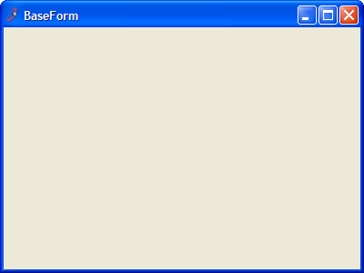
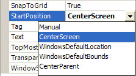
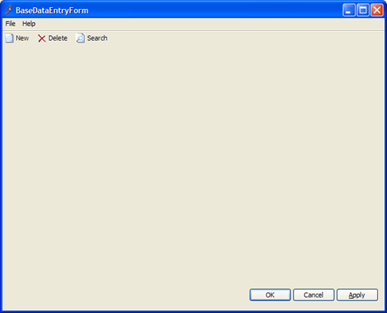

If you ask a new .NET developer (from the Access or VB6 world) what is the best thing about .NET Windows Forms, most of your answers will be "Form Inheritance" that allows them to keep a nice consistent look for all forms. If you ask them a couple of months later, they will probably tell you the worst thing about .NET Windows Forms is "Form Inheritance". This is because they have had too many problems with the bugs in the form designer regarding this feature. Many abandon them altogether and jump on the user control band wagon. Please don't... we have a solution to this...

<!--endintro-->

If you can keep the level of form inheritance to a minimum, then you may not see the problem or at least you will experience the problem less. Anyway even if you do, stop whinging and just close down Visual Studio.NET and restart. You don't change the base form that often anyway.     

Well how do you keep it to a minimum? Well make the first base form without any controls, only code (to make it as flexible as possible and avoid having a multitude of base forms).

We try to keep the number of controls on inherited forms, and the levels of inheritance to a minimum, because it reduces the risk of problems with the Visual Studio Designer (you know when the controls start jumping around, or disappearing from the Designer, or properties getting reset on inherited copies or even the tab order getting corrupted). Designer errors can also occur in the task list if the **InitializeComponent** method fails.

Every form in your application should inherit from a base form which has code common to every form, for example: 

* Company Icon
* Remembering its size and location - Code sample to come in the [SSW .NET Toolkit](https://ssw.com.au/ssw/NETToolkit)
* Adding itself to a global forms collection if SDI (to find forms that are already open, or to close all open forms)
* Logging usage frequency and performance of forms (load time)                                                     

a) Sorting out the **StartPosition**:

1. **CentreParent** only for modal dialogs (to prevent multi-monitor confusion)
2. **CentreScreen** only for the main form (MainForm), or a splash screen
3. **WindowsDefaultLocation** for everything else (99% of forms) - prevents windows from appearing on top of one another

b) Sorting out **FormBorderStyle**:

1. **FixedDialog** only for modal dialog boxes
2. **FixedSingle** only for the the main form (MainForm) - **FixedSingle** has an icon whereas **FixedDialog** doesn't
3. **None** for splash screen
4. **Sizable** for everything else (99% of forms) - almost all forms in an app should be resizable

We have a program called [SSW CodeAuditor](https://codeauditor.com) to check for this rule.

c) Sorting out a base data entry form:

1. Inherited from the original base form
2. OK, Apply and Cancel buttons
3. Menu control
4. Toolbar with New, Search and Delete

**Note:** The data entry base form has no heading - we simply use the Title Bar.

We have a program called [SSW .NET Toolkit](https://ssw.com.au/ssw/NETToolkit) that implements inherited forms.
