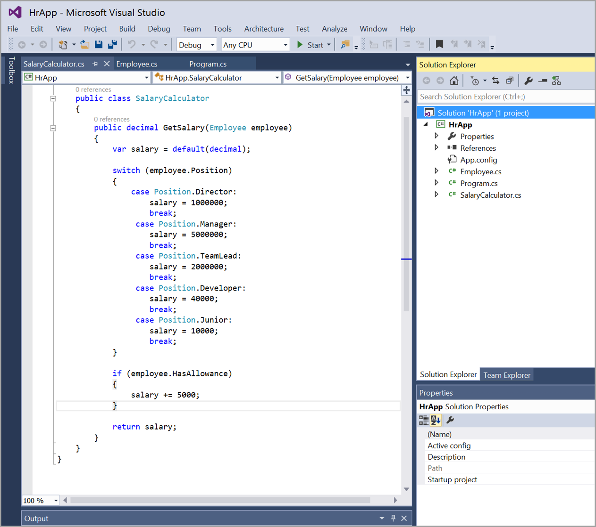
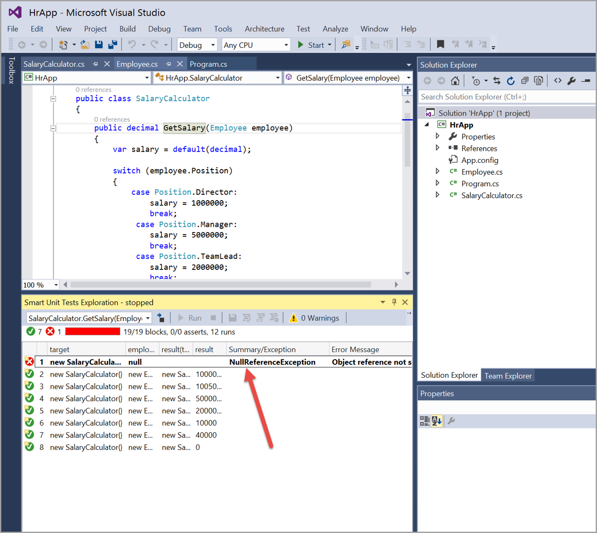

It is difficult to measure test quality as there are a number of different available metrics - for example, code coverage and number of assertions. Furthermore, when we write code to test, there are a number of questions that we must answer, such as, "is the code easily testable?" and "are we only testing the happy path or have we included the edge cases?"​

However, the most important question a dev can ask themselves is, "What assertions should I test?​".

This is where IntelliTesting comes into play. The feature, formerly known as Smart Unit Testing (and even more formerly known as PEX), will help you answer this question by intelligently analyzing your code. Then, based on the information gathered, it will generate a unit test for each scenario it finds. 

 <excerpt class='endintro'></excerpt> 
<dl class="badImage"><dt>​</dt><dd>Figure: Bad example - What’s wrong with this code?</dd></dl><dl class="goodImage"><dt>​</dt><dd>Figure: Good example - IntelliTest in action​​</dd></dl>
In short, by using IntelliTest, you will increase code coverage, greatly increase the number of assertions tested, and increase the number of edge cases tested. By adding automation to your testing, you save yourself time in the long run and reduce the risk of problems in your code caused by simple human error. 

