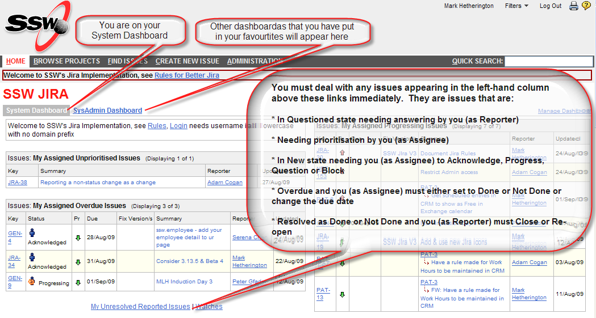

Summary:  Login  to Jira and clear the issues from the top left of your dashboard usually by answering a question or closing.

 Jira issues can enter states where it is important that action is taken immediately by either the Reporter or the Assignee.  These actions are always quick to do but keep others informed and keep the workflow going.   
<!--endintro-->

 Any issues that require your immediate attention appear at the top of the left-hand column (see screenshot later) of your dashboard.  Following this rule will ensure that the Reporter always knows the status, priority and plan for the issue resolution and the Assignee is never help up by the Reporter; this empowers you to "work efficiently on the right things in a visible way".

 In the SSW Jira implementation, there are six situations where action is required by you swiftly and these appear on your dashboard in one or more of six filters:

| **Dashboard Filter:**  |  **Status Now**  |  **You need to:**  |  **(As you are Performing the Role of:)**  |  **Which will change the Status to:**  |
| --- | --- | --- | --- | --- |
| My Issues to Approve | Awaiting Approval | Approve or Reject | Adam | New |
| My Reported Issues to Answer | Questioned |  Answer or Close |  Reporter |  New |
| My Assigned Unprioritised Issues | --various-- | Set priority with Update, Acknowledge, Progress | Assigneee | --various-- |
| My Assigned New Prioritised Issues | New | Acknowledge, Progress, Done, Not Done, Block | Assignee | --various-- |
| My Assigned Overdue Issues | --various-- | Update (with new due date), Done, Not Done | Assignee | --various-- |
| My Reported Issues to Close | Resolved | Close or Re-open | Reporter | Closed or New |

 NOTE: Most people will only have Reporter actions to perform. [Understand more about Reporters and Assignees](/Pages/ReportesAndAssignees.aspx) 

[login like this](/Pages/HowdoIsignintoJira.aspx)** **and clearly shows the issues that need your immediate attention 
** 
 For guidance on dealing with issues check out our other rules:

[Answering](/Pages/HowdoIansweraquestioninJira.aspx)[SSW Dashboard](/Pages/SystemDashboard.aspx)
[Reporters and Assignees](/Pages/ReportesAndAssignees.aspx)
[SSW Workflow](/Pages/workflow.aspx)
[Jira Rules Page](/Management/RulesToBetterJira)
