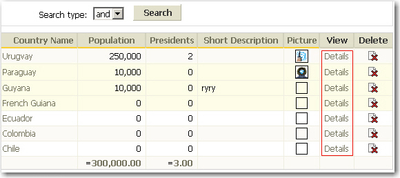

It is common when we browse a list page, we have to click the "More..." or "Details" button to view the item detail. This process takes more time because we need to wait for the loading of the detail page.

 To improve the performance, we can use jQuery plus CSS to show tooltips in the list page that can let users determine which item detail they want to see.   
<!--endintro-->
<dl class="badImage">    &lt;dt&gt; &lt;/dt&gt;
    <dd>Figure: Bad Example - redirect to a new page to view the detail </dd></dl><dl class="goodImage">    &lt;dt&gt; &lt;/dt&gt;
    <dd>Figure: Good Example - show tooltip when mouse is over in the list </dd></dl>
