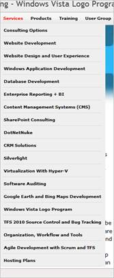
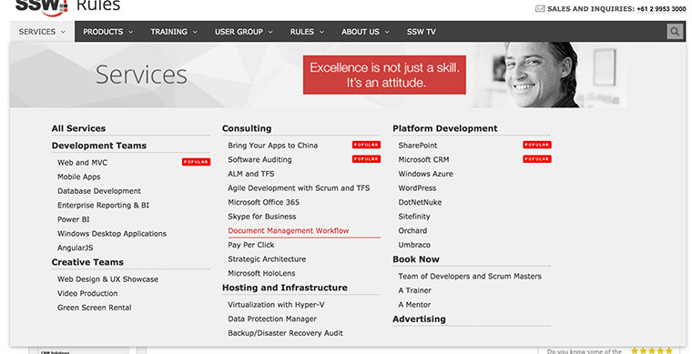
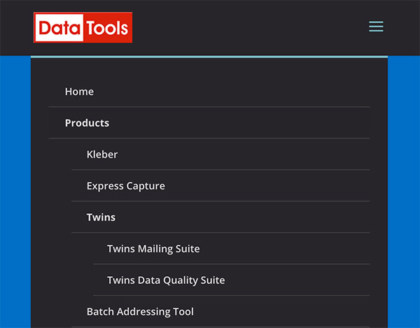

So you started your site with simple navigation but then you find 
yourself a few years later with site navigation that is saturated with 
links and everything looks messy. 

Mega menu allows you to present your links in groups 
and make use of typography, icons and supporting images to explain 
user's choices.

 <excerpt class='endintro'></excerpt> 

By dividing site navigation into groups users will have better view of your site's structure at a glance and thus presenting them with meaningful choices. You can also group key pages together and give them emphasis.

Of course, don't use a mega dropdown menu just because you can. Turning your normal navigation into mega-menu whilst keeping it as one continuous level is generally a no-no. in the same manner, just because mega-menus have room, doesn't mean you should overload them.
<dl class="badImage"><dt>  </dt><dd>Figure: Bad Example - Long drop down menu requires scrolling and difficult to see at a glance. </dd></dl><dl class="goodImage"><dt>  </dt><dd>Figure: Good Example - Links are grouped into distinct category</dd></dl> <dl class="image"> <dt> ​ </dt><dd>Figure: Bear in mind that mobile menus are limited</dd></dl>

