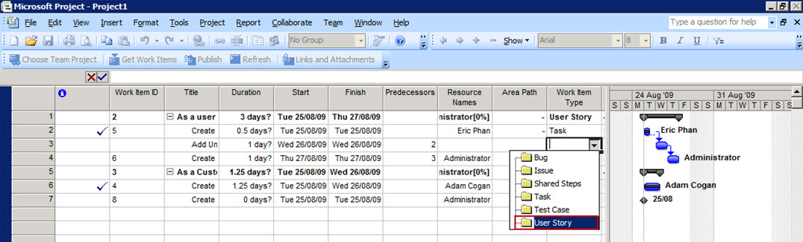

In VSTS 2008/2005, the MS Project integration was very bad. You cannot publish your hierarchies with your work items. In VSTS 2010, this had been fixed. With the native support for hierarchy work item support in TFS 2012, all of your work in MS Project will be published to TFS 2012. 

<!--endintro-->
 
 **Figure: VSTS2010 has better MS Project integration support - you can publish your hierarchies to TFS now**
