As long as you have work items created and your developers keep them up to date, you can use MS Project to calculate project budget usage in real-time; this helps the project manager to determine the progress in term of $ which is what client really care about. 
 Note: To have this working properly, you need VSTS 2010 because it has better MS Project integration. 

<!--endintro-->

### Calculate the total cost for your release

Follow the steps below to save a baseline and track your project budget usage:

1. Open MS Project and connect to your Team Project 
  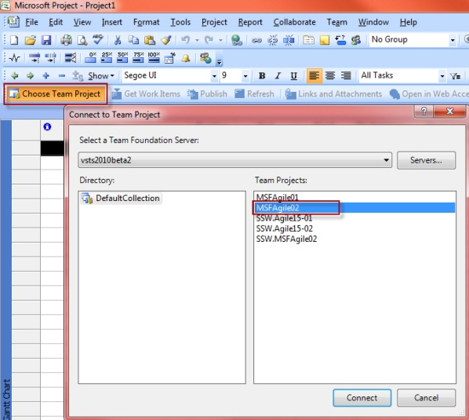
  
2. Query the work items from the team project 
  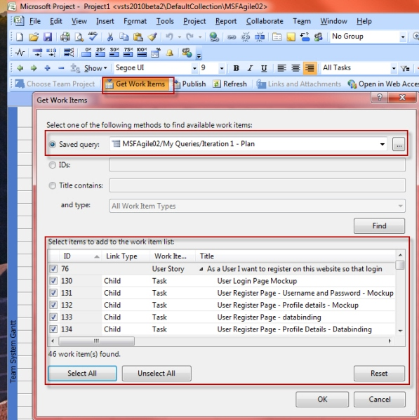
  
3. Note: normally you want to create queries for each of your Releases, then you can quickly import them together.

4. To Track progress, we will use the "Team System Task Sheet" view; this can be selected from the "View" menu.

5. Your work items will be imported and arranged within a hierarchy. As we are trying to track the progress, we want to keep “Original Estimate”, “Remaining Work” and “Completed Work” together, so drag them after the Work Item Title.
  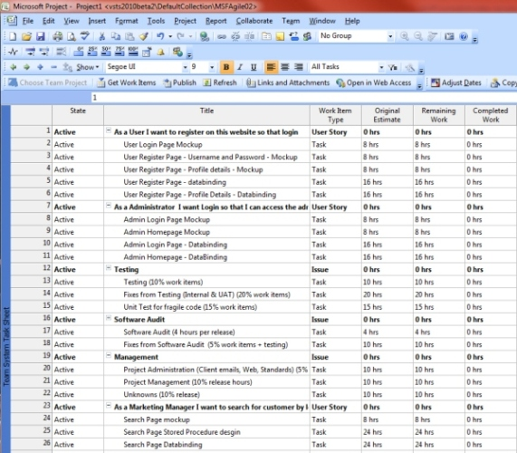

6. In order to have the cost calculated, we need to assign a rate to each of the resources. This can be done by going to “View | Resource Sheet”
  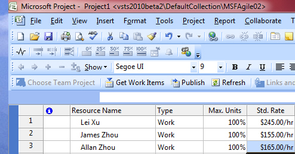

7. When you switch back to “Team System Task Sheet”, you will want to add the following fields so we can see the cost status:
  a.  Baseline Cost
  b. Remaining Cost
  c. Actual Cost 

  You will notice the “Remaining Cost” column has been calculated based on the “Remaining Work” column and the Rate we entered for each task. 
  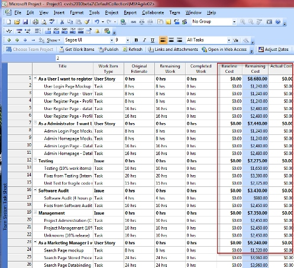

8. In order for MS Project to calculate and display a total cost for your current release you will need to add a summary task at the top level of the project tasks.
  Choose the 1st task in your project, right click and create a “New Task” 
  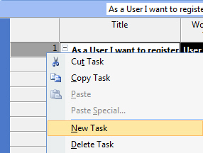 

  Name the task as per your release name so you know what this plan is for; also you don’t want this task to be created in your TFS as a work item because it’s just a summary, set “Publish and Refresh” as “No”. 
   
  In order to make this a summary item you need to select all the other tasks and indent them. To achieve this click the little red forward arrow in the toolbar.
  
  Now, your summary task is ready and it’s showing the total cost for your current release:
  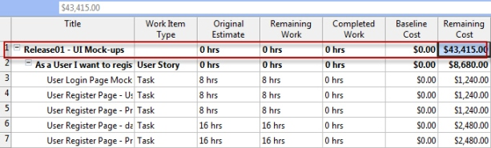

### Baseline management

Baseline management is very important for every project manager as it helps you to determine the budget usage; once the client approves your initial estimate for the project it will become your baseline. So before you set a baseline in your MS Project, make sure the client approves it.

To set a baseline, choose “Tools, Tracking, Set Baseline” from the menu: 

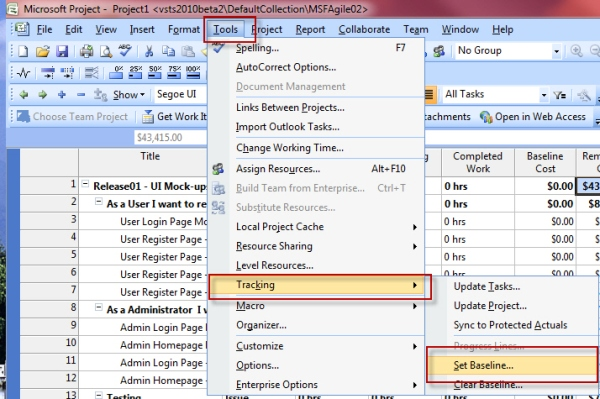

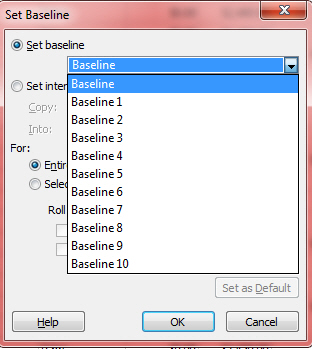

A handy feature of MS Project is its ability to handle multiple baselines. Use a new baseline to seek approval from clients when they alter the project scope. 

Once your baseline is set, you will be able to see the “Baseline Cost” column is showing $

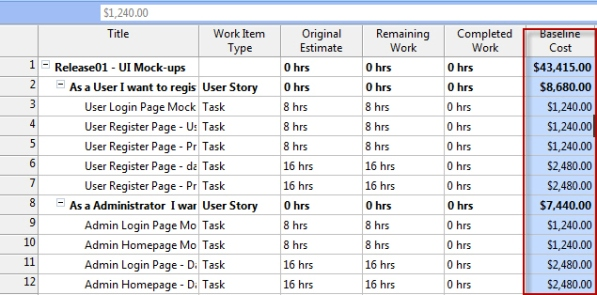

### Track your project on the go

When your project is running, your developers will update the “Remaining Work” and “Completed Work” columns from TFS, they may not use MS Project so you will need to refresh your MS Project file to get these changes, and the $ will be calculated on the fly to give you up-to-date status.

To refresh your project file, simply click on the “Refresh” button in the toolbar. 

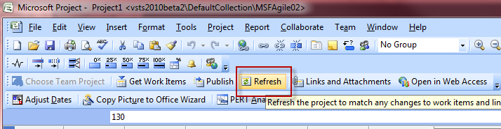

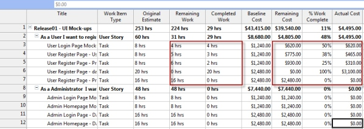

**Note:** If you find that the values are not calculating properly, it may be that the calculation mode is set incorrectly. If pressing F9 updates the values you should change the setting “Tools | Options | Calculation” from “Manual” to “Automatic”.

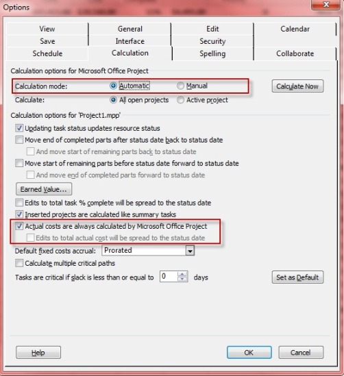

Also make sure “Actual costs are always calculated by Microsoft Office Project” is enabled.
