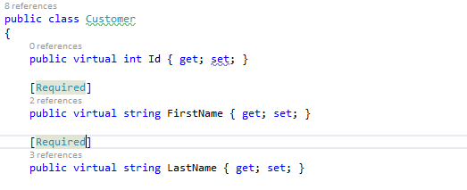
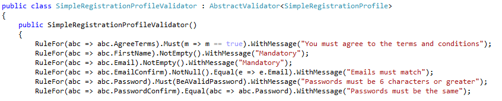
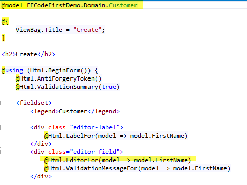
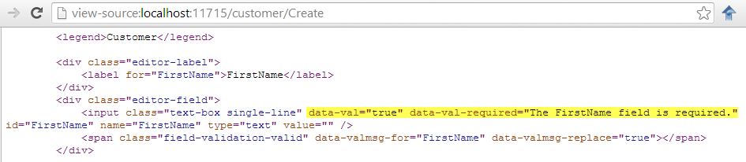
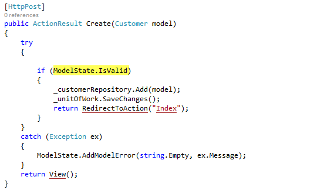

Validation is an important part of any data-driven web application. Client-Side validation provides fast user feedback and a better UI experience but cannot be relied on for data integrity - so client-side validation should always be backed by additional server-side validation.

With MVC Unobtrusive Validation, you can configure both client-side and server-side in one place. 

 <excerpt class='endintro'></excerpt> 

Validation rules can be added to a model object via Data Annotations or using the Fluent Validation API.

Fluent Validation is <a href="http://www.nuget.org/packages/FluentValidation/">available as a Nuget package</a>. See <a href=/use-fluent-validation>Do you use Fluent Validation? </a>  
<dl class="image"><dt></dt><dd>Figure: OK Example - Data Annotation attributes decorate model properties to make them required</dd></dl><dl class="image"><dt></dt><dd>Figure: Better Example - Fluent Validation allows validation metadata to be added to a class without modifying the original class.  This provides much more flexibility for code reuse</dd></dl>
If you create a new MVC web application in VisualStudio 2013, unobtrusive validation will be enabled by default. Otherwise, it's simple to <a href="http://www.nuget.org/packages/Microsoft.jQuery.Unobtrusive.Validation/">install from Nuget</a>. To use it simply:
<ol><li>​Bind your razor views to model objects  </li><li>Use Html Helpers to render the form UI</li></ol>
<dl class="goodImage"> <dt></dt><dd>Figure: Good Example - this razor view binds to a strongly typed model object and uses HTML helpers.</dd></dl><dl class="image"><dt></dt><dd>Figure: the HTML UI rendered for this view now has data-validation attributes that are followed by JQuery validation to provide rich client-side validation.</dd></dl><dl class="image"><dt></dt><dd>Figure: On the server-side, the same validation rules will be checked when you call ModelState.IsValid</dd></dl>

