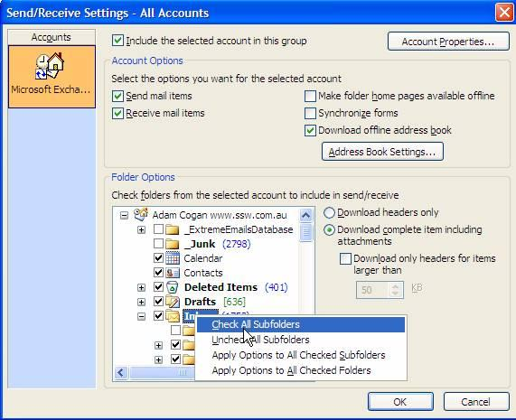

And remember to periodically select "Check All Subfolders" to make sure all folders are being synced in your .ost file.

<!--endintro-->
<dl class="image">&lt;dt&gt;&lt;/dt&gt;<dd>Figure: Periodically check that all your mail folders are being synced in your offline.ost file </dd> </dl>
