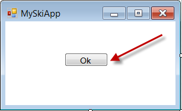
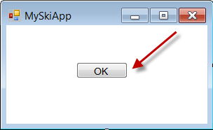

Make sure you use correct casing and wording for "OK" in buttons and content.

<!--endintro-->

::: bad

:::

::: good

:::

We have a program called [SSW Code Auditor](https://ssw.com.au/ssw/CodeAuditor/Rules.aspx#ANCBTN) to check for this rule.
