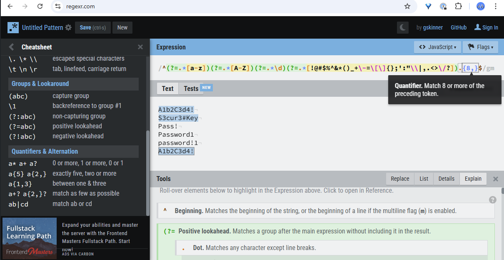

Regular expressions (regex) are powerful tools for pattern matching and text processing, but they can be challenging to write and debug. Online regex tools like [RegExr](https://regexr.com/) and [Regex101](https://regex101.com/) simplify this process by providing interactive environments to test, debug, and learn regex. These tools save time, reduce errors, and help you master regex faster.

<!--endintro-->

### Why Use Online Regex Tools?

* **Instant Feedback**: Test your regex patterns in real-time and see immediate results.
* **Learning Resources**: Many tools include tutorials, examples, and explanations to help you understand regex syntax.
* **Debugging Features**: Identify issues in your regex with visual aids and detailed error messages.
* **Cross-Platform**: These tools are accessible from any browser, making them convenient for developers on the go.

```python
import re

# Define the regex pattern for validating passwords
pattern = r"^(?=.*[a-z])(?=.*[A-Z])(?=.*\d)(?=.*[!@#$%^&*()_+\-=\[\]{};':\"\\|,.<>\/?]).{8,}$"

# List of passwords to validate
passwordList = [
    "A1b2C3d4!",
    "S3cur3#Key",
    "Pass!",
    "Password1",
    "password!1",
    "A1b2C3d4!"   
]

# Loop through the passwords and use re.search to validate them
for password in passwordList:
    if re.search(pattern, password):
        print(f"Valid: {password}")
    else:
        print(f"Invalid: {password}")
```

```code
Valid: A1b2C3d4!
Valid: S3cur3#Key
Invalid: Pass!
Invalid: Password1
Invalid: password!1
Valid: A1b2C3d4!
```

::: bad
Figure: Writing and testing regex directly in your code without live validation.  

:::


::: good
Figure: Using RegExr to debug and validate your pattern before implementation.  

:::

### Best Online Regex Tools

* **[RegExr](https://regexr.com/)** (Recommended)
  * User-friendly interface and community-driven examples.
  * Open source and can be hosted privately. See [https://github.com/gskinner/regexr/](https://github.com/gskinner/regexr/)
* **[Regex101](https://regex101.com/)**
  * Regex debugger to step through your pattern.
  * Code generator for multiple programming languages.
  * Extensive regex library and quick reference guide.

::: info
Avoid overcomplicating your regex patterns; use the tools to simplify and optimize them.

:::
