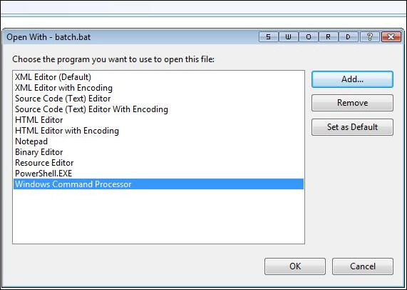
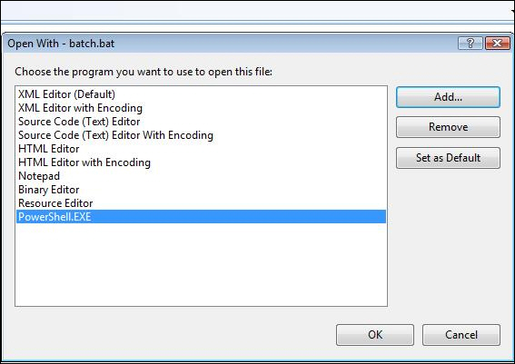

Windows Command Processor (cmd.exe) cannot run batch files (.bat) in Visual Studio because it does not take the files as arguments. One way to run batch files in Visual Studio is to use PowerShell.   
<!--endintro-->
<dl class="badImage">    &lt;dt&gt; &lt;/dt&gt;
    <dd>Bad example - Using Windows Command Processor (cmd.exe) for running batch files. </dd></dl><dl class="goodImage">    &lt;dt&gt; &lt;/dt&gt;
    <dd>Good example - Using PowerShell for running batch files</dd></dl>
