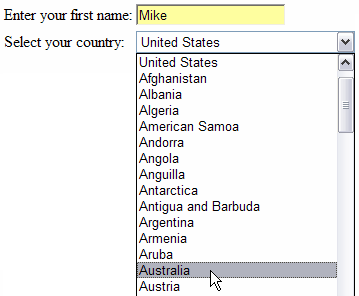
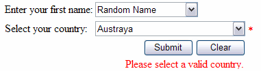
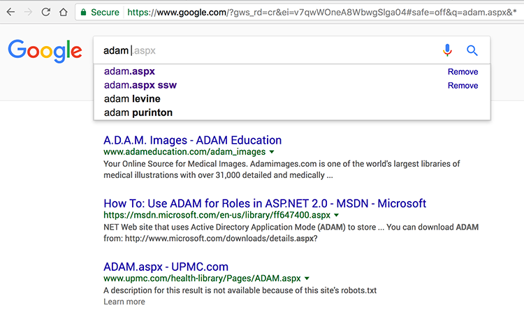

​
When getting users to choose data from a medium-long list, or to enter data that has been predefined (such as Country names), it is a good idea to use a predictive-text combo rather than normal combo or text boxes. A good implementation of predictive-text combos will also perform a type-ahead effect, providing the user with a richer experience.

 <excerpt class='endintro'></excerpt> 

Also, predictive textboxes can be used with validation, or without. In instances where you don't mind if users add data to your collection you can turn validation off; however, to keep your collection clean, it is recommended to use validation.
<dl class="badImage"><dt>  </dt><dd> Figure: Bad Example - Using a Textbox and Combo to enter list data</dd></dl><dl class="goodImage"><dt>  </dt><dd> Figure: Good Example - Predictive-Text combo with Type Ahead</dd></dl><dl class="goodImage"><dt>  </dt><dd> Figure: Good Example - Predictive-Text combo with and without validation</dd></dl>
To see this in action <a href="https://www.ssw.com.au/Demos/PredictiveTextCombo/">try our Predictive-Text Combos demo</a>.
<dl class="goodImage"><dt> </dt><dd> Figure: Best Example - Google search ​ </dd></dl>

