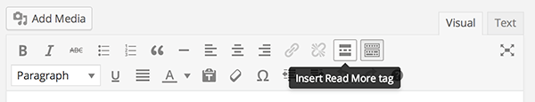
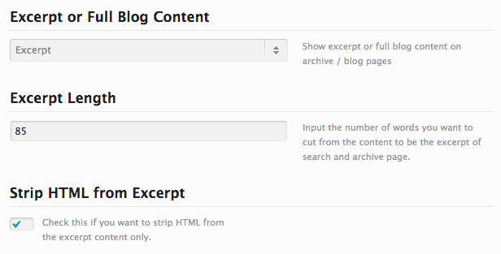

By default, WordPress shows the whole article content on a post list. Knowing that some posts are quite long - taking a lot of real estate on the page - it's a good idea to summarize it and add a "read more" link. 

<!--endintro-->

You can split your blog entries so that only the first part of certain posts is displayed on the home and archive pages. When you do this, a link will be placed after the intro, pointing the reader to the full post.
To do so, you can either edit the source index.php (or similar) file; or just click the "Read More" tag button in the first row of the visual editor toolbar (or press  **Alt+Shift+T** ):

``` php
replace <?php the_content(); ?> with <?php the_excerpt(); ?>
```
::: bad
Figure: Bad example - changing source PHP files is complicated and require developer skills 
:::

::: good  
  
:::

**Note:** This is out-of-the-box with WordPress. You won't need a plugin.

### Custom Read More Message

To customize the message, simply add a space after  **&lt;!--more** and insert the text you want to show:

``` html
<!--more Read the full post -->
```
**Figure: Custom "read more" link**

### Some WordPress themes do this automatically

Many WordPress themes will have an option to not show the full blog content on the homepage. E.g. in Avada (one of the most popular themes) it has this:

::: good  
  
:::

Always check theme options before going back through posts to add in the Read More tags manually.
