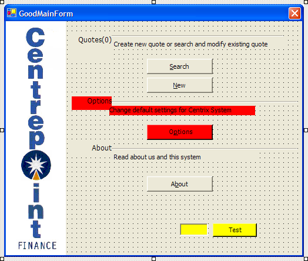

Use colours on incomplete is so useful in design time:

* Red = Controls which are incomplete, e.g. An incomplete button
* Yellow = Controls which are deliberately invisible that are used by developers e.g. Test buttons

<!--endintro-->

Usually these controls are always yellow. However sometimes new areas on forms are made red and visible, so you can get UI feedback on your prototypes. Since they are red, the testers know not to report this unfinished work as a bug. 

