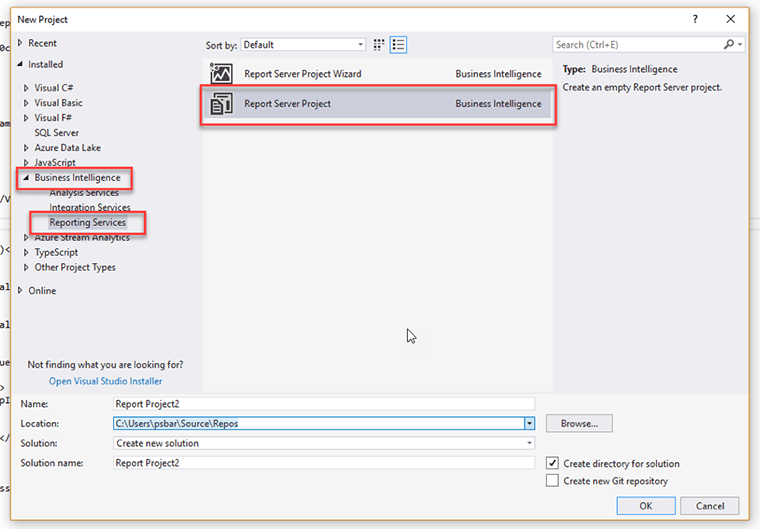
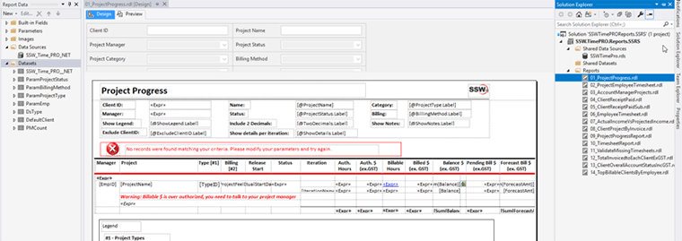

When working with SSRS reports, you need to have the right type of project otherwise it will be difficult for a developer, to create new reports or update existing ones.

If you have some reports and want to check them into source control, if you add them to project that is not a report project, your reports will not open in the design/preview view (allowing to see the DataSource and DataSets). They will open in the XML view (which is not pretty to work with).

<!--endintro-->
<dl class="badImage">&lt;dt&gt;&lt;/dt&gt;<dd>Figure: Bad example – C# project with reports opening as XML</dd></dl>
To open the reports in the right view you will need to:

1. Be sure that you VS has the tool/extensions Microsoft Reporting Services Projects installed, go to  **Tools** |  **Extensions and Updates** |  **Online** , and search for services
<dl class="image">&lt;dt&gt;&lt;/dt&gt;<dd>Figure: Checking Microsoft Reporting Services Projects is installed</dd></dl>
    * In the micros Microsoft Download and install [SQL Server Data Tools (SSDT) for Visual Studio website](https://docs.microsoft.com/en-us/sql/ssdt/download-sql-server-data-tools-ssdt?view=sql-server-2017) you will find all the instructions to install the tool via Marketplace or SSDT standalone installer.
2. Create the project selecting  **Business Intelligence** |  **Reporting Services** |  **Report Server Project** 
<dl class="image">&lt;dt&gt;&lt;/dt&gt;</dl>
3. Add existing reports and create your new DataSource (based in the information on your Report Portal)
<dl class="goodImage">&lt;dt&gt;&lt;/dt&gt;<dd>Figure: Good Example – Report Server project with reports opening in the design/preview view </dd></dl>
