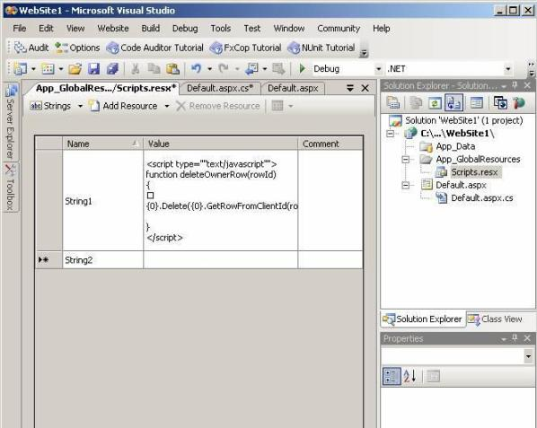

Write a Intro pragraph here

 <excerpt class='endintro'></excerpt> 

  <h2> </h2>
<dl class="badCode">
    <dt style="width:92.31%;height:190px;">
    <pre>     StringBuilder sb = new StringBuilder();      sb.AppendLine(@"&lt;script type=""text/javascript""&gt;");      sb.AppendLine(@"function deleteOwnerRow(rowId)");      sb.AppendLine(@"{");      sb.AppendLine(string.Format(@"{0}.Delete({0}.         GetRowFromClientId(rowId));", OwnersGrid.ClientID));      sb.AppendLine(@"}");      sb.AppendLine(@"&lt;/script&gt;"); </pre>
    </dt>
    <dd>Bad example - Hard to read ?the string is surrounded by rubbish + inefficient because you have an object and 6 strings</dd>
</dl>

 

<dl class="goodCode">
    <dt style="width:93.08%;height:100px;">
    <pre>     string.Format(@"&lt;script type=""text/javascript""&gt;                          function deleteOwnerRow(rowId)                           { {0}.Delete({0}.GetRowFromClientId(rowId)); } &lt;/script&gt; ",         OwnersGrid.ClientID);                                    </pre>
    </dt>
    <dd>Good example Slightly easier to read ?but it is 1 code statement across 10 lines</dd>
</dl>
<dl class="goodCode">
    <dt style="width:92.33%;height:86px;">
    <pre>     string scriptTemplate = Resources.Scripts.DeleteJavascript;      string script = string.Format(scriptTemplate, OwnersGrid.ClientID); </pre>
    </dt>
</dl>
<dl class="goodCode">
    <dt style="width:91.4%;height:161px;">
    <pre>     &lt;script type=""text/javascript""&gt;      function deleteOwnerRow(rowId)      {             {0}.Delete({0}.GetRowFromClientId(rowId));      }      &lt;/script&gt; </pre>
    </dt>
</dl>

<b>Figure: The code in the first box, the string in the resource file in the 2nd box. This is the easiest to read + you can localize it eg. If you need to localize an Alert in the javascript</b>

<dl class="image">
    <dt> </dt>
    <dd>Figure: Add a recourse file into your project in VS2005</dd>
</dl>
<dl class="image">
    <dt> </dt>
    <dd>Figure: Read value from the new added resource file</dd>
</dl>

