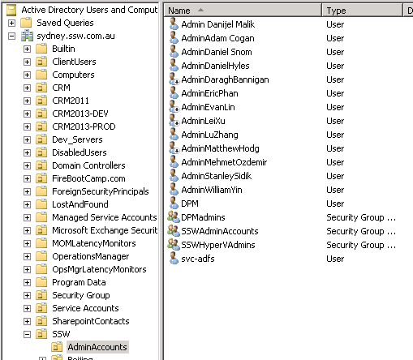

When using a single account for normal user login and admin tasks the first thing that comes to mind is all of the Group Policy settings associated with that account. This could include scripts, software installations, drive mappings, printers and many other settings that would apply when you log on to a computer in the domain. You wouldn’t want all of these to apply when log on to a Domain Controller of any other servers.

 <excerpt class='endintro'></excerpt> 
Another reason is you may step away from your computer and forget to lock the computer. This will expose your computer for your co-workers and tinker with your system and as a consequence if that account has domain administrator privilege they can change system security and settings on any Domain Controller and other servers.

    To prevent this, at SSW we create a separate Administrator account, with the prefix Admin. This signifies that it is an Admin account and does have administrator privileges. The Admin account is also placed in a separate OU to ensure that it is not receiving unnecessary Group Policies. This allows us to setup permissions easier, only provide access to machines required, and also makes the user aware that they are doing something dangerous so they are inheritably more careful. A standard account (Non Admin prefix account) does not and should not have access to any servers.
<dl class="image"><dt></dt><dd>Figure: SSW AD Users and Computers showing Admin accounts in separate OU</dd></dl>​

