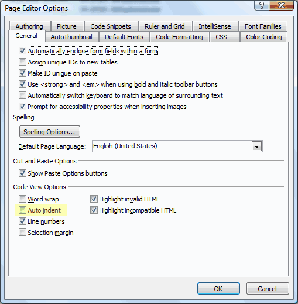

  
We love SharePoint designer and use it everyday.  

But there are things that it doesn't do naturally, or it does really badly.  Here are some tips on using SharePoint designer well.

<ul>
    <li>Don't use inline CSS - this goes for any website. </li>
    <li>Always put &lt;div class="..."&gt; wrappers around SharePoint controls. This allows us to define styles for SharePoint controls. It is possible to use CssClass like ASP.NET, but then we lose control to SharePoint regarding how that control will be rendered.  Also, some SharePoint controls will eat up your CssClass and not render anything. </li>
    <li>Naming convention for control id! Don't get lazy. </li>
    <li>Turn off Auto indent.  Otherwise SharePoint designer will keep modifying your file whenever it saves the HTML - this will make you very upset.</li>
</ul>

 <excerpt class='endintro'></excerpt> 

  
 

