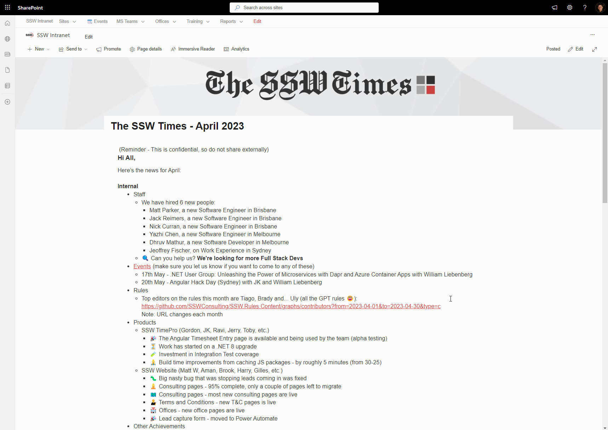

Sharing the news is an effective way to update the team about important developments, announcements, and articles. SharePoint's News feature provides a streamlined platform for disseminating information and engaging your team members, now enhanced with the capability to send news directly to email.

### Getting Started

1. Navigate to SharePoint and locate the "My News" section on the left side of the page.
2. If you're using the News feature for the first time:

* Select "Create news post" to create a new post from scratch or select from a template.
* Alternatively, you can select a news post from the previous month and click the "+ New" button, followed by "Copy of this News Post" to duplicate the content.

### Creating the News

1. Once you're in the News post editor, update the date to reflect the current or intended publication date.
2. Enter your news content in the provided text editor. Be clear, concise, and engaging in your writing, keeping in mind the target audience for the news post.
3. You can use formatting options such as headings, bullet points, bold or italic text to enhance the readability and visual appeal of your news post.
4. Consider including relevant images, videos, or attachments to provide additional context or resources, if necessary.
5. Proofread your news post for any spelling or grammatical errors before publishing.
6. Imform the company that the news is ready by clicking the "Send To" button located on the news site.
7. **New Feature:** After creating your post, use the option to send it directly to email. This can be done by selecting a new option to distribute the news post as an email, ensuring wider reach and accessibility.

### Maintaining consistent site naming

1. Once you have saved the news post, click the settings icon in the top right corner of the SharePoint page.
2. From the dropdown menu, select "Site Contents" and then click on "Site Pages" to access the page listing.
3. Locate your news post file within the list and select it.
4. Click on the "Rename" option to change the file name.
5. Follow a consistent naming convention, such as using the format "The-SSW-Times-YYYY-MM" (e.g., The-SSW-Times-2023-05).
6. Ensure that the file name reflects the content of the news post and includes relevant identifiers, such as the title or date.

## Benefits of using SharePoint's News feature, now with email integration

* Enhanced visibility and discoverability: Provides a central platform for news, now accessible both on SharePoint and directly via email.

* Structured and organized content: News posts are well-formatted, with the added benefit of being optimized for email viewing.

* Engagement and collaboration: SharePoint's News feature encourages interaction and collaboration among team members. Readers can leave comments, ask questions, or provide feedback directly on the news post, fostering a sense of community and promoting active engagement.

* Version control and archiving: With SharePoint, you can easily maintain a version history of your news posts. This allows you to track changes, revert to previous versions if needed, and keep a comprehensive record of past announcements or updates.

* Analytics and insights: SharePoint provides analytics and usage data, allowing you to track the reach and engagement of your news posts. You can Gain insights from both SharePoint and email interactions, understanding the full scope of your news post's impact.

::: good

Figure: Good Example - Share the latest announcement and updates using a digital method, such as SharePoint

:::
