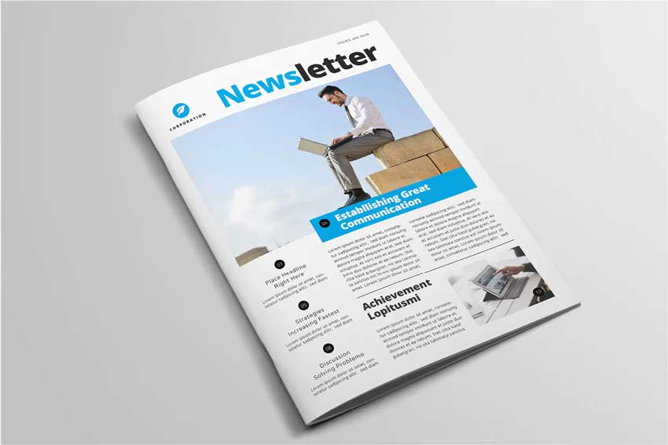

Sharing the news is a great way to update the team about important updates, announcements, and articles. While some companies choose to send an email to the whole organization, SharePoint's News feature provides a better way to disseminate information effectively and engage your team members.

### Accessing the News feature:

Navigate to SharePoint and locate the "My News" section on the left side of the page.
If you're using the News feature for the first time:
Select "Create news post" to create a new post from scratch.
Alternatively, you can select a news post from the previous month and click the "+ New" button, followed by "Copy of this News Post" to duplicate the content.

### Updating the news post:

Once you're in the News post editor, update the date to reflect the current or intended publication date.
Enter your news content in the provided text editor. Be clear, concise, and engaging in your writing, keeping in mind the target audience for the news post.
You can use formatting options such as headings, bullet points, bold or italic text to enhance the readability and visual appeal of your news post.
Consider including relevant images, videos, or attachments to provide additional context or resources, if necessary.
Proofread your news post for any spelling or grammatical errors before publishing.

### Maintaining consistent site naming:

Once you have saved the news post, click the settings icon in the top right corner of the SharePoint page.
From the dropdown menu, select "Site Contents" and then click on "Site Pages" to access the page listing.
Locate your news post file within the list and select it.
Click on the "Rename" option to change the file name.
Follow a consistent naming convention, such as using the format "The-SSW-Times-YYYY-MM" (e.g., The-SSW-Times-2023-05).
Ensure that the file name reflects the content of the news post and includes relevant identifiers, such as the title or date.

::: bad 

Figure: Bad Example - Paper Newsletters are time-consuming to print and are bad for the environment.

:::

::: good 

Figure: Good Example - Share the latest announcement and updates using a digital method, such as SharePoint

:::