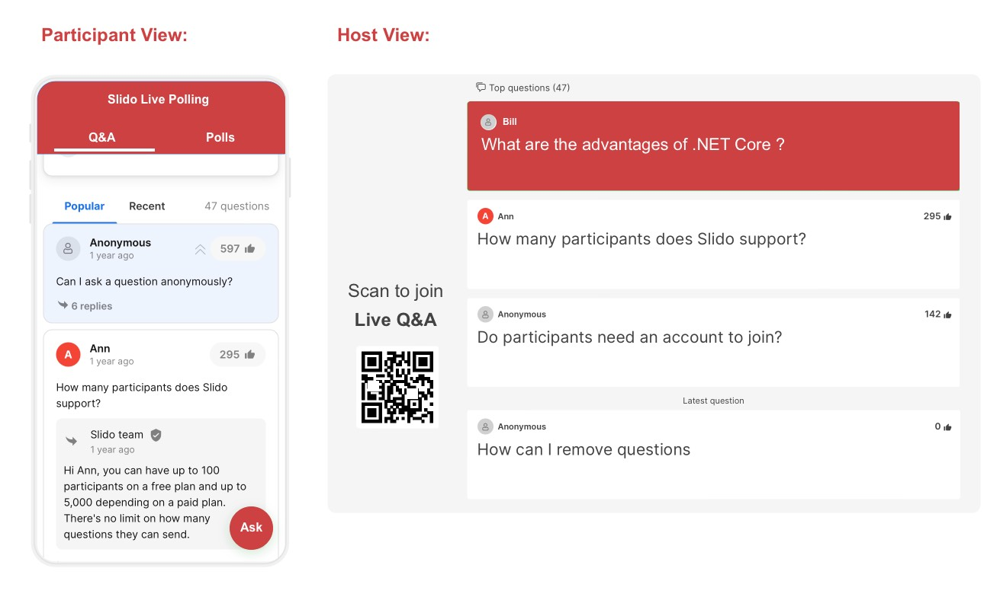
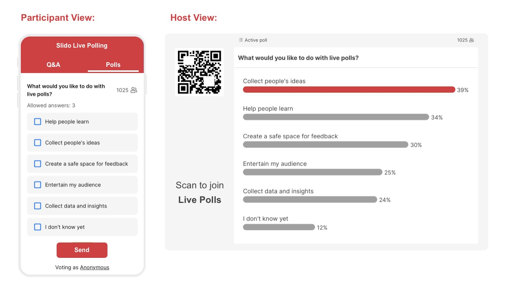

Slido is an online platform which provide the easiest way to collect questions for your Q&A sessions, it also run interactive presentations with a top-rated live polling tool.

<!--endintro-->

You can ask your audience to scan QR code to send questions, the audience also can see and upvote the best questions on their mobile devices. You can approve and display the best questions on the presentation screen and highlight the ones that are being answered. All questions are automatically saved for export and analysis.

Live polls are a great way to collect thoughts and engage with audience. You can do all different types of polls with Slido, such as multiple choice, rating and open text. You can display the poll on the presentation screen with the results updated in realtime.

