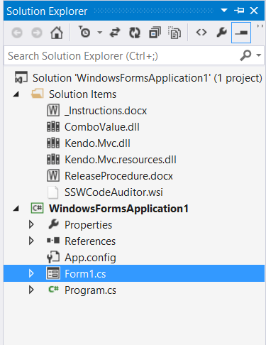

All the DLL references and files needed to create a setup.exe should be included in your solution. However, just including them as solution items is not enough, they will look very disordered (especially when you have a lot of solution items). And from the screenshot below, you might be wondering what the \_Instructions.docx is used for...   
<!--endintro-->

::: bad
Bad example - An unstructured solution folder  
:::

An ideal way is to create "sub-solution folders" for the solution items, the common ones are "References" and "Setup". This will make your solution items look neat and in order. Look at the screenshot below, now it makes sense, we know that the \_Instructions.docx contains the instructions of what to do when creating a setup.exe.

::: good
Good example - A well structured solution folder has 2 folders - "References" and "Setup" 

:::

| We have a program called [SSW Code Auditor](http://www.ssw.com.au/ssw/CodeAuditor/Default.aspx) to check for this rule.  |
| --- |
