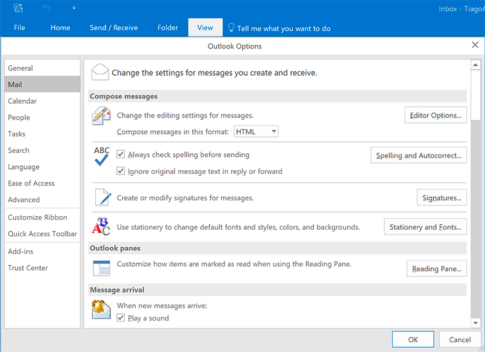

Improper spelling, grammar, and punctuation on your emails give a bad impression of your company. It looks unprofessional and can result in your message not being conveyed correctly. To ensure this doesn't happen, use Microsoft Outlook Spelling & Grammar Checker on the 'Editor Options' window.

<!--endintro-->

