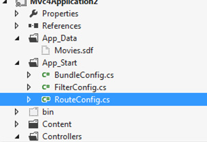

Adding code to the Application\_Start method in the Global.asax file is the easiest and most straight-forward approach for executing startup logic, however, this code should be encapsulated in static methods outside the Global.asax file. Doing this helps provide cleaner code and encourages proper adherence to the Single Responsibility principle.

<!--endintro-->
<dl class="badImage">&lt;dt&gt;  ::: greybox <pre>public class MvcApplication : System.Web.HttpApplication
{
    protected void Application_Start()
    {
        AreaRegistration.RegisterAllAreas();

        routes.IgnoreRoute("{resource}.axd/{*pathInfo}");

        routes.MapRoute(
            name: "Default",
            url: "{controller}/{action}/{id}",
            defaults: new { controller = "Home", action = "Index", id = UrlParameter.Optional }
        );        }
}

</pre> :::  &lt;/dt&gt;<dd>Figure: Bad Example – Logic is implemented in the Application_Start method which breaks the Single Responsibility Principle</dd></dl><dl class="goodImage">&lt;dt&gt;  ::: greybox <pre>public class MvcApplication : System.Web.HttpApplication
{
    protected void Application_Start()
    {
        AreaRegistration.RegisterAllAreas();

        WebApiConfig.Register(GlobalConfiguration.Configuration);
        FilterConfig.RegisterGlobalFilters(GlobalFilters.Filters);
        RouteConfig.RegisterRoutes(RouteTable.Routes);
        BundleConfig.RegisterBundles(BundleTable.Bundles);
        AuthConfig.RegisterAuth();
    }
}
</pre> :::   
       &lt;/dt&gt;<dd>Figure: Good Example – Startup tasks are called from the Application_Start method but are located in the App_Start folder  </dd></dl>
