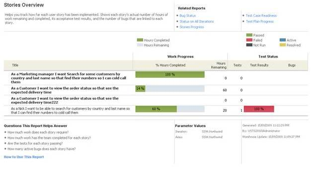

A common question for every project manager is "where is my project at?" This question isn't just asked to find out how many tasks are done, but also to understand if all these tasks are done to meet users' requirements.

Both the Visual Studio Scrum and MSF for Agile project templates in TFS 2010 and 2012 provide a built-in "Stories Overview" report to help you find out where the project is at, as well as to tell you if all the tasks are well tested.

<!--endintro-->

 

**Tip:** Set this up on a [daily schedule so the Scrum Team get this in their inbox each day](/reports-do-you-schedule-the-burndown-and-stories-overview-reports-to-be-emailed-to-the-team-every-day).

**Suggestion for Microsoft #1:** Add a Summary Number in large font at the top, eg. 55% complete.

**Suggestion for Microsoft #2:** Add this great report to the Microsoft Scrum TFS Process Template.

::: greybox

#### Where are we at?

"TFS’s Stories Overview Report is the best tool to solve the common question project managers ask the developers “Where are we at?”

The problem with the answer is that developers almost always say 90%"

[@AdamCogan](https://twitter.com/adamcogan)

:::

Need to know $$$? Read [Do you get regular updates on costs and progress (aka Project Progress, Burndown, Story Overview)?](/watch-do-you-get-regular-updates-on-costs-and-progress-%28aka-project-progress-burndown-etc-%29) to see which reports you need to get a complete project progress overview.
