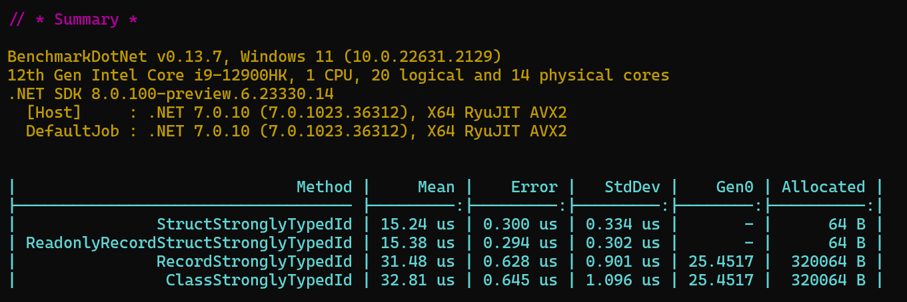

Developers often fall into the trap of using primitive types (`int`, `string`, `Guid`) for entity identifiers when using Entity Framework (EF) because it is straight forward to simply add a `string` or `int` or `Guid` as the `ID` field for an entity. The misuse of the primitive types lead to **Primitive Obsession**.

Primitive Obsession refers to a code smell or anti-pattern where primitive data types (such as integers, strings, booleans, etc.) are excessively used to represent domain concepts, instead of creating dedicated classes to encapsulate those concepts.

<!--endintro-->

Consider this example of Primitive Obsession:

```cs
public class Person
{
    public Guid Id { get; set;}
    public string FirstName { get; set; }
    public string LastName { get; set; }
    public string EmailAddress { get; set; }
    /// ... more stuff
}

public class Customer
{
    public Guid Id { get; set;}
    public string Name { get; set; }
    /// ... more stuff
}
```

The Guid `Id` value of a `Person` entity can easily be mistaken or used as the Guid `Id` value of a `Customer` entity because there is no strong typing or encapsulation to prevent these two different entity ID types from being used interchangeably.

Primitive Obsession can be witnessed on almost any domain concept, not just IDs (e.g. EmailAddress, PhoneNumber, Currency). To combat Primitive Obsession, we should consider creating meaningful and domain-specific classes to represent our concepts. By encapsulating related data and behavior into these classes, we can improve our code readability, maintainability, and flexibility. See [Do you know when to use value objects?](/when-to-use-value-objects/) for examples of replacing data with Value Objects.

Using **Strongly Typed IDs** we can avoid the anti-pattern and clearly represent our domain entity specific identifiers.

Now with **C# 9** (and later) we can use the `record` (for one line declarations) or even the `record struct` (for better performance - see below) type to declare strongly typed IDs very succinctly. With `record`s we no longer need to implement or override equality operators - they are automagically generated for us by the compiler.

For example:

```cs
public readonly record struct PersonId(Guid Value);

public readonly record struct CustomerId(Guid Value);

public class Person : BaseEntity
{
    public PersonId Id { get; set;}
    public string FirstName { get; set; }
    public string LastName { get; set; }
    public string EmailAddress { get; set; }
    /// ... more stuff
}

public class Customer : BaseEntity
{
    public CustomerId Id { get; set;}
    public string Name { get; set; }
    /// ... more stuff
}
```

Viola! Now we have strongly typed IDs on our `Person` and `Customer` entities and no way for anyone to get the values confused or misuse them.

## How do we configure EF to work with Strongly Typed IDs

To enable the correct serialization of Strongly Type IDs we need to add some configuration code to our EF Entities so that EF knows how to convert between the Primitive type and the Strongly Typed ID values.

Here is one way to specify the configuration:

```cs
public class PersonConfiguration : IEntityTypeConfiguration<Person>
{
    public void Configure(EntityTypeBuilder<Person> builder)
    {
        // Primary Key
        builder.HasKey(e => e.Id);

        // Configuration for converting the `id` property To that will be stored in the database and From the primitive value (e.g. GUID, int, string) back into a strongly typed Id:
        builder.Property(e => e.Id)
            .HasConversion(
                // from Strong ID to Primitive value
                id => id.Value,
                // from Primitive value to Strong ID
                guidValue => new PersonId(guidValue))
            // enable the primitive value to be auto-generated when adding (SaveChanges) new entities to the database (only works from EF Core 7 onwards)
            .ValueGeneratedOnAdd();
    }
}
```

Another slightly cleaner looking approach could be to use a `ValueConverter`:

```cs
public class PersonConfiguration : IEntityTypeConfiguration<Person>
{
    public void Configure(EntityTypeBuilder<Person> builder)
    {
        var converter = new ValueConverter<PersonId, Guid>(
            id => id.Value, 
            guidValue => new PersonId(guid));

        builder.HasKey(e => e.Id);

        builder.Property(e => e.Id)
            .HasConversion(converter)
            .ValueGeneratedOnAdd();
    }
}
```

Check out the [SSW Clean Architecture template](https://github.com/SSWConsulting/SSW.CleanArchitecture/blob/main/src/Domain/TodoItems/TodoItem.cs) for a few examples of Strongly Typed IDs in action.

## Performance considerations

As mentioned earlier, we could use `record` or `record struct` to succinctly describe our strongly typed IDs.

However, when using `record` there is a performance penalty we pay as pointed out by Dan Patrascu on his CodeWrinkles YouTube video [Stop Using Records As Strongly Typed IDs!](https://www.youtube.com/watch?v=dJxVj6390hk).

Dan suggests to use `struct` or `class` instead because generating 10,000 strongly typed Ids is 4x faster compared to using `record`.

However, `class` and `struct` are more verbose and require that we implement the `Equals` and `GetHashCode` overrides manually!

Dan unfortunately missed out a benchmark for `record struct`. We wrote our own benchmark's similar to Dan's and as it turns out `record struct` gives us the best of both worlds! We get the performance of `struct` and the succinct one liner declarations of `record` without needing to manually implement the equality checks.



Check out William Liebenberg's [StronglyTypeIdsBenchmark](https://github.com/william-liebenberg/StronglyTypedIdsBenchmarks) repo on GitHub for the benchmark results.

## Summary

To add strongly typed IDs to our Entity Framework Entities we can utilize the `record struct` and add some simple entity configuration code to convert between primitive and strong type values.

It is worth noting that `record`'s are immutable by default, but `record struct`'s are not :(

We can regain the immutability by adding the `readonly` modifier to our strongly typed ID declaration. With the `readonly` keyword the compiler will give us the same warnings at build time when any unwanted mutation to the ID value is made (or attempted to be made).

So the ultimate programming construct for Strongly Typed IDs is `readonly record struct`.

```cs
public readonly record struct UserId(Guid Value);
```
